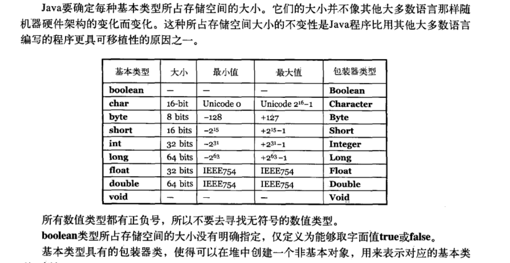

# 第一章 对象导论

## 1.1 抽象过程

> 面向对象思想实质：程序可以通过添加新类型的对象使自身适用于某个特定问题。

Alan Kay 总结面向对象语言的五个基本特性：

1. 万物皆对象。
2. 程序是对象的集合，他们通过发送消息来告知彼此所要做的。
3. 每个对象都有自己的由其他对象所构成的存储。
4. 每个对象都拥有其类型。
5. 某一特定类型的所有对象都可以接受同样的消息。

> Booch 对对象描述：**对象具有状态、行为和标识**。这意味着每个对象都可以拥有内部数据（他们给出了该对象的状态）和方法（它们产生行为），并且每一个对象都可以唯一地与其他对象区分开来，具体来说就是**每一个对象在内存中都有一个唯一的地址**。

## 1.2 每个对象都有一个接口

## 1.3 每个对象都提供服务

## 1.4 被隐藏的具体实现

Java 用三个关键字在类的内部设定边界：public、private、protected。这些**访问指定词**（access specifier）决定了紧跟其后被定义的定西可以被谁使用。

public：表示紧随其后的元素对任何人都是可用的。

private：表示除类型创建者和类型的内部方法之外的任何人都不能访问。

protected：与 private 作用相当，差别仅在于继承的类可以访问。

默认访问权限（没有使用任何访问指定词）：类可以访问在同一个包（库构造）中的其他类的成员。

## 1.5 复用具体实现

新的类可以由任意数量、任意类型的其他对象以任意可以实现新的类中想要的功能的方式所组成。因为是在使用现有的类合成新类，所以这种概念被称为**组合**（composition），如果组合式动态发生的，那么它通常被称为**聚合**（aggregation）。组合经常被视为“has-a”（拥有）关系。

## 1.6 继承

### 1.6.1 "是一个"与“像是一个”关系

## 1.7 伴随多态的可互换对象

如果不需要知道哪一段代码会被执行，那么当添加新的子类时，不需要更改调用它的方法，他就能够执行不同的代码。因此，编译器无法精确地了解哪一段代码会被执行，那么它该怎么办？

编译器不可能产生传统意义上的函数调用。一个非面向对象编程的编译器产生的函数调用会一起所谓的**前期绑定**。这么做意味着编译器将产生对一个具体函数名字的调用，而运行时将这个调用解析到将要被执行的代码的绝对地址。然而在 OOP 中，程序直到运行时才能够确定代码的地址，所以当消息发送到一个泛化对象时，必须采用其他的机制。

为了解决这个问题，面向对象程序设计语言使用了**后期绑定**的概念。当对象发送消息时，被调用的代码直到运行时才能确定。编译器确保被调用方法的存在，并对调用参数和返回值执行类型检查（无法提供此类保证的语言被称为时弱类型的），但是并不知道被执行的确切代码。

为了执行后期绑定，Java 使用一小段特殊的代码来替代绝对地址调用。这段代码使用在对象存储的信息来计算方法体的地址（这个过程将在第 8 章中详述）。这样，根据这一小段代码的内容，每一个对象都可以具有不同的行为表现。当向一个对象发送消息时，该对象就能够知道对这条消息应该做些什么。

把将导出类看做是它的基类的过程称为向上转型（upcasting）。转型（cast）这个名称的灵感来自于模型铸造的塑模动作；而向上（up）这个词来源于继承图的典型布局方式：通常基类在顶部，而导出类在其下部散开。因此，转型为一个基类就是在继承图中向上移动，即“向上转型”。

## 1.8 单根继承结构

在 Java 中，所有的类最终都继承自单一的基类（Object）。

在根单继承结构中的所有对象都具有一个公用接口，所以他们归根到底都是相同的基本类型。

单根继承结构保证所有对象都具备某些功能。可以知道在系统中可以在每个对象上执行某些基本操作。所有对象都可以很容易在堆上创建，而参数传递也得到了极大地简化。

单根继承结构使垃圾回收机器的实现变得容易得多，而垃圾回收器正是 Java 相对 C++ 的重要改进之一。由于所有对象都能够保证具有其类型信息，因此不会因为无法确定对象的类型而陷入僵局。这对于系统级操作（如异常处理）显得尤其重要，并且给编程带来了更大的灵活性。

## 1.9 容器

如果不知道在解决某个特定问题时需要多少个对象，或者他们将存活多久，那么就不可能知道如何存储这些对象。如何才能知道需要多少空间来创建这些对象？答案是不可能知道，因为这类信息只有在运行时才能获得。

对于面向对象设计中的大多数问题而言，这个问题的解决方案似乎过于轻率：创建另一种对象类型，这种新的对象类型持有对其他对象的引用。当然，你可以用在大多数语言中都有的数组类型来实现相同功能。但是这个通常被称为容器的新对象，在任何需要时都可以扩充自己以容纳你置于其中的所有东西。因此不需要知道将来会把多少个对象置于容器中，只需要创建一个容器对象，然后让他处理所有细节。

从设计的观点来看，真正需要的只是一个可以被操作，从而解决问题的序列。如果单一类型的容器可以满足所有需要，那么就没有理由设计不同类的序列了。然而还是需要对容器有所选择，这有两个原因。第一，不同容器提供了不同类型的接口和外部行为。堆栈相比于队列就具备不同的接口和行为，也不同于集合和列表的接口和行为。第二，不同容器对于某些操作具有不同的效率。ArrayList 查询快、增删满；LinkedList 增删快、查询慢。

### 1.9.1 参数化类型

在 Java SE5 出现之前，容器存储的对象都只具有 Java 中的通用类型 Object。单根继承结构，使得容器容易被复用。

由于容器只存储 Object，所以当将对象引用置入容器时，他必须被向上转型为 Object，因此它会丢失其身份。当把它取回时，向下转型为更具体的类型。除非确切知道所要处理的对象类型，否则向下转型几乎是不安全的。如果向下转型为错误类型，会得到被称为异常的运行时错误。当从容器中去除对象引用时，还是必须药以某种方式记住这些对象研究是什么类型，这样才能执行正确的向下转型。

向下转型和运行时检查需要额外的程序运行时间，创建这样的容器，它知道自己所保存的对象的类型，从而不需要向下转型以及消除犯错组的可能。这种解决方案被称为参数化类型机制。参数化类型就是一个编译器可以自动定制作用于特定类型上的类。

Java SE5 的重大变化之一就是增加了参数化类型，在 Java 中称为泛型。一堆尖括号，中间包含类型信息。

```java
ArrayList<Shape> shapes = new ArrayList<Shape>();
```

## 1.10 对象的创建和生命期

## 1.11 异常处理：处理错误

## 1.12 并发编程

## 1.13 Java 与 Internet

### 1.13.1 Web 是什么

1. 客户/服务器计算技术

客户/服务器系统的核心思想是：系统具有一个中央信息存储池（central repository of information），用来存储某种数据，它通常存在于数据库中，你可以根据需要将它分发给某些人员或机器集群。

2. Web 就是一台巨型服务器

### 1.31.2 客户端编程

1. 插件
2. 脚本语言
3. Java
4. 备选方案
5. .NET 和 C#
6. Internet 与 Intranet

### 1.13.3 服务器端编程

## 1.14 总结

# 第二章 一切都是对象

## 2.1 用引用操纵对象

## 2.2 必须由你创建所有对象

### 2.2.1 存储到什么地方

1. **寄存器**。位于处理器内部，速度最快，数量有限，按需分配，不能直接控制。
2. **堆栈**。位于通用 RAM 中，通过堆栈指针可以从处理器那里获得直接支持。堆栈指针向下异动，则分配新内存；向上移动，则释放内存。高效的分配存储方式，仅次于寄存器。
3. **堆**。通用内存池，也位于 RAM 区，用于存放所有的 Java 对象。
4. **常量存储**。常量值通常直接存放在程序代码内部，有时存放在 ROM 中（例：字符串池）。
5. **非 RAM 存储**。流对象和持久化对象。把对象转化成可以存放在其他媒介上的事物，在需要时，可以恢复成常规的、基于 RAM 的对象。

### 2.2.2 特例：基本类型

new 出来的对象存储在堆里。基本类型不用 new 创建，非引用自动变量，存放在栈里。



#### 高精度数字

两个高精度计算的类：BigInterger 和 BigDecimal。

BigInteger 支持任意精度的整数。

BigDecimal 支持任意精度的定点数。

### 2.2.3 Java 中的数组

在 C 和 C++ 中的数组就是内存块。如果一个程序要访问其自身内存块之外的数组，或在数组初始化之前使用内存，都会产生难以预料的后果。

Java 确保数组会被初始化，而且不能在它的范围之外被访问。这种范围检查，是以没个数组上少量的内存开销及运行时的下标检查为代价的。但换来的是安全性和效率的提高，因此付出的代价是值得的。

创建一个数组对象时，实际上就是创建了一个引用数组，并且每个引用都会自动被初始化为一个特定值，该值拥有自己的关键字 null。一旦 Java 看到 null，就知道这个引用还没有指向某个对象。在使用任何引用前，必须为其指定一个对象；如果试图使用一个还是 null 的引用，在运行时将会报错。

还可以创建用来存放基本数据类型的数组。编译器会确保这种数组的初始化，将这种属组所占的内存全部置零。

## 2.3 永远不需要销毁对象

### 2.3.1 作用域

**作用域**（scope）决定了在其内定义的变量名的可见性和生命周期。在 C、C++ 和 Java 中，作用域由花括号的位置决定。

### 2.3.2 对象的作用域

Java 对象不具备和基本类型一样的生命周期。当用 new 创建一个 Java 对象时，它可以存活于作用域之外。

```java
{
	String s = new String("a string")；
}
```

引用 s 在作用域充电就消失了。然而，s 指向的 String 对象仍继续占据内存空间。在这一小段代码中，我们无法在这个作用域之后访问这个对象，因为对它唯一的引用已超出了作用于的范围。

## 2.4 创建新的数据类型：类

class 关键字

### 2.4.1 字段和方法

定义了一个类，就可以在类中设置两种类型的元素：字段（数据成员）和方法（成员函数）。字段可以是任何类型的对象，可以通过其引用与其进行通信；也可以是基本类型中的一种。如果字段式对某个对象的引用，必须初始化改引用，使其与懿哥实际的对象相关联。

每个对象都有用来存储其字段的空间；普通字段不能在对象间共享。

引用一个对象的成员：在对象引用的名称之后紧接着一个句点，然后再接着是对象内部的成员名称。

#### 基本成员默认值

若类的某个成员是基本数据类型，即使没有初始化， Java 也会确保它获得一个默认值。

当变量作为类的成员使用时，Java 才会确保给定其默认值，局部变量并不适用。

## 2.5 方法、参数和返回值

方法的基本组成部分包括：名称、参数、返回值和方法体。

### 2.5.1 参数列表

## 2.6 构建一个 Java 程序

### 2.6.1 名字可见性

### 2.6.2 运用其他构件

想使用预先定义好的类，通过 import 关键字告诉编译器位置

### 2.6.3 static 关键字

执行 new 创建对象时，数据存储空间才被分配，其方法才供外界调用。

两种情形 new 无法解决，通过 static 可以：

1. 只想为某特定域分配单一存储空间，而不去考虑究竟要创建多少个对象，甚至跟不就不创建任何对象。
2. 希望某个方法不与包含它的类的任何对象关联在一起。即使没有创建对象，也能够调用这个方法。

示例：

```java
class StaticTest{
	static int i = 47;
}
```

## 2.7 你的第一个 Java 程序

### 2.7.1 编译和运行

指令：

```bash
javac hello.java
java hello
```

## 2.8 注释和嵌入式文档

两种注释风格：

1. 传统 /**/
2. 单行注释 //

### 2.8.1 注释文档

javadoc

javadoc 只能为 public 和 protected 成员惊醒文档注释。

### 2.8.2 语法

```java
/**
* @
* @
*/
```

### 2.8.3 嵌入式 HTML

略

### 2.8.4 一些标签示例

略

### 2.8.5 文档示例

略

## 2.9 编码风格

类名的首字母要大写；如果类名由几个单词构成，那么把他们并列在一起（不要用下划线分割名字），其中每个内部单词的首字母都采用大写形式。

这种风格称作“驼峰风格”。

方法，字段以及对象一用名称，第一个字母采用小写。

## 2.10 总结

## 2.11 练习

# 第三章 操作符

## 3.1 更简单的打印语句

## 3.2 使用 Java 操作符

## 3.3 优先级

## 3.4 赋值

赋值是使用操作符“=”。它的意思是右值复制给左值。右值可以是任何常数、变量或者表达式。但左值必须是一个明确的、已命名的变量。

举例：

```java
a = 4; //正确
// 4 = a; 错误
```

对基本数据类型赋值是很简答的。

对对象赋值的时候，真正操作的是对对象的引用。所以“将一个对象赋值给另一个对象”，实际上是将“引用”从一个地方复制到另一个地方。这意味着假若对对象使用 c=d，那么 c 和 d 都指向原本只有 d 指向的那个对象。

### 3.4.1 方法调用中的别名问题

## 3.5 算数操作符


# 第十五章 泛型

- 在面向对象变成语言中，多态算是一种泛化机制。例如，你可以将方法的参数类型设置为基类，那么该方法就可以接受从这个基类中导出的任何类作为参数。
- Java SE5 提出泛型概念。
- 泛型实现了 **参数化类型** 的概念，使代码可以应用于多种类型。
- 泛型术语意思：适用于许多的类型。
- 在你创建参数化类型的一个实例时，编译器会为你负责转型操作，并保证类型的正确性。

## 15.1 与 C++ 的比较

## 15.2 简单泛型

Java 泛型核心概念：告诉编译器想使用什么类型，编译器处理一切细节。

### 15.2.1 一个元组类库

元组：将一组对象直接打包存储与其中的一个单一对象。这个容器对象允许读取其中元素，但是不允许像其中存放新的对象。

```java
public class TwoTuple<A,B>{
    public final A first;
    public final B second;
    public TwoTuple(A a, B b){
        first = a;
        second = b;
    }
}
```

- 元组隐含地保持了其中元素的次序。
- final 声明保证了安全性。
- 利用继承机制实现长度更长的元组。

### 15.2.2 一个堆栈类

### 15.2.3 RandomList

## 15.3 泛型接口

- 泛型可以应用于接口。例如生成器（generator），这是一种专门负责创建对象的类。

```java
public interface Generator<T> { T next(); }
```

## 15.4 泛型方法 ？

- 是否拥有泛型方法，与其所在的类是否是泛型没有关系。
- 泛型方法使得该方法能够独立于类而产生变化。

> 基本指导原则：无论何时，只要能做到，就应该只使用泛型方法。
>
> 也就是说，如果使用泛型方法可以取代整个类泛型化，那么就应该只使用泛型方法，因为它可以使事情更清楚明白。
>
> 对于一个 static 的方法而言，无法访问泛型类的类型参数，所以，如果 static 方法需要使用泛型的能力，就必须使其成为泛型方法。

定义泛型方法：将泛型参数列表置于返回值之前。

```java
public class GenericMenthods{
    public <T> void f(T x){
    	System.out.println(x.getClass().getName());
	}
    public static void main(String[] args){
        GenericMethods gm = new GenericMethods();
        gm.f("");
        gm.f(1);
    }
}
```

> 当时用**泛型类**时，必须在创建对象的时候指定类型参数的值，而使用**泛型方法**的时候，通常不必指明参数类型，因为编译器会为我们找出具体的类型。这称为**类型参数推断**。
>

### 15.4.1 杠杆利用类型参数推断

- 类型推断只对赋值操作有效。

> 如果将一个泛型方法调用的结果（例如New.map()）作为参数，传递给另一个方法，这时编译器并不会执行类型推断。在这种情况下，编译器认为：调用泛型方法后，其返回值被赋给一个 Object 类型的变量。
>

- 显式的类型说明（编写非赋值语句时使用）

> 要显式地指明类型，必须在点操作符与方法名之间插入尖括号，然后把类型置于尖括号内。如果是在定义该方法的类的内部，必须在点操作符之前使用 this 关键字，如果是使用 static 的方法，必须在点操作符之前加上类名。
>

用/显示的类型说明/语法/解决/泛型方法调用的结果作为参数/例子：

```java
public class ExplicitTypeSpecification{
    static void f(Map<Person, List<pet>> petPeople){}
    public static void main(String[] args){
        //f(New.map()); //Dose not compile
        f(New.<Person, List<Pet>>map());
    }
}
```

### 15.4.2 可变参数与泛型方法

### 15.4.3 用于 Generator 的泛型方法

### 15.4.4 一个通用的 Generator

### 15.4.5 简化元组的使用

### 15.4.6 一个 Set 实用工具

## 15.5 匿名内部类 ？

## 15.6 构建复杂模型 ？

## 15.7 擦除的神秘之处 ？

- 在泛型代码内部，无法获得任何有关泛型参数类型的信息。

> Java 泛型是使用擦除来实现的，这意味着当你使用泛型时，任何具体的类型信息都会被擦除了，你唯一知道的就是你在使用一个对象。因此 List<String> 和 List<Integer> 
>
> 在运行时事实上是相同的类型。这两种形式都被擦除成了它们的"原生"类型，即List。

### 15.7.1 C++的方式 

C++：模板被实例化时，模板代码知道其模板参数的类型。

Java：协助泛型类，给定泛型类的边界，以此告知编译器只能接受遵循这个边界的类型。比如重用 extends 关键字。

> 泛型类型参数将擦除到它的第一个边界（它可能会有多个边界），我们还提到了类型参数的擦除。编译器实际上会把类型参数替换为它的擦除。

### 15.7.2 迁移兼容性 

迁移兼容性：擦除的核心动机是它使得繁华的客户端可以用非泛化的类库来使用，反之亦然。

### 15.7.3 擦除的问题

> 擦除主要的正当理由是从非泛化代码的转变过程，以及在不破坏现有类库的情况下，将泛型融入 Java 语言。擦除使得现有的非泛型客户端代码能够在不改变的情况下继续使用，直至客户端准备好用泛型重写这些代码。
>
> 擦除的代价是显著的。泛型不能用于显示地引用运行时类型的操作之中。

```java
//关闭警告注解，Java SE5 之前的版本中不支持
//这个注解被放置在可以产生这类警告的方法之上，而不是整个类上。
@SupperessWarnings("unchecked")
```

### 15.7.4 边界处的动作 

> 泛型中的所有动作都发生在边界处——对传递进来的值金鼎额外的编译期检查，并插入对传递出去的值的转型。这有助于澄清对擦除的混淆，记住，“边界就是发生动作的地方”。

## 15.8 擦除的补偿 ？

### 15.8.1 创建类型实例

### 15.8.2 泛型数组

## 15.9 边界

## 15.10 通配符

- （复习）编译在左，运行在右。

```java
public static void Main(String[] args){
    Fruit[] fruit = new Apple[10];
    fruit[0] = new Apple(); //OK
    fruit[1] = new Jonathan(); //OK
    // Runtime type is Apple[]
    try{
        //Compiler allows you to add Fruit:
        fruit[0] = new Fruit(); // ArrayStoreException
    }catch(Expection e){
        System.out.println(e);
    }
}/* Output:
java.lang.ArrayStoreException:Fruit */
//泛型会在编译器就报错
public class NonCovariantGenerics{
    //Compile Error: incompatible types:
    List<Fruit> first = new ArrayList<Apple>();
}
```

- 有时想要在两个类型之间建立某种类型的向上转型关系，这正是通配符所允许的：

```java
public static void main(String[] args){
    //Wildcards allow covariance:
    List<? extends Fruit> = new ArrayList<Apple>();
    //Compile Error:can't add any type of object;
    //first.add(new Apple());
    //first.add(new Fruit());
    //first.add(new Object());
    first.add(null);//Legal but uninteresting
    //We know that it returns at least fruit:
    Fruit f = flist.get(0);
}
```

> List<? extends Fruit> 读作“具有任意从Fruit继承的类型的列表”。但这实际上并不意味着这个List将持有任何类型的Fruit。通配符引用的是明确的类型。因此它意味着“某种first应用没有指定的具体类型”
>
> 不知道List只有的具体类型，无法安全地向其中添加对象。向上转型，所以丢失掉想其中传递任何对象的能力。
>
> 调用一个返回Fruit的方法是安全的，编译器允许这么做

### 15.10.1 编译器有多聪明

### 15.10.2 逆变

- 超级类型通配符

> 可以生命通配符是由某个特定的任何基类来界定。
>
> 方法指定<? super MyClass>，甚至使用类型参数<? super T>。
>
> 不能对泛型参数给出一个超类型边界，即不能声明<T super MyClass>。

```java
public class SuperTypeWildcards {
    static void writeTo(List<? super Apple> apples){
        apples.add(new Apple());
        apples.add(new Jonathan());
        //apples.add(new Fruit()); //Error
    }
}
```

super 确定 apple 是下界，可以向其中添加 Apple 及其子类。

根据向一个泛型类型“写入”（传递给一个方法），以及如何能够从一个泛型类型中“读取”（从一个方法中返回），思考子类型和超类型的边界。超类型边界放松了在可以想方法传递的参数上所做的限制：

```java
public class GenricWriting{
    static <T> void writeExact(List<T> list, T item){
        list.add(item);
    }
    static List<Apple> apples = new ArrayList<Apple>();
    static List<Fruit> fruit = new ArrayList<Fruit>();
    static void f1(){
        writeExact(apples, new apple);
        // writeExact(fruit, new apple); //Error:
        // Incompatible tyoes: fount Fruit, required Apple
    }
    static <T> void writeWithWildcard(List<? super T> list, T item){
        list.add(item);
    }
    static void f2(){
        writeExact(apples, new apple);
        writeExact(fruit, new apple); //Error:
    }
}
```

### 15.10.3 无界通配符

> 由于泛型参数将擦除到他的第一个边界，因此 List<?> 看起来等价于 List<Object>，而 List 实际上也是 List<Object>。
>
> List 实际上表示“持有任何 Object 类型的原生 List”，而 List<?> 表示“具有某种特定类型的非原生 List，只是我们不知道那种类型是什么”

### 15.10.4 捕获转换


