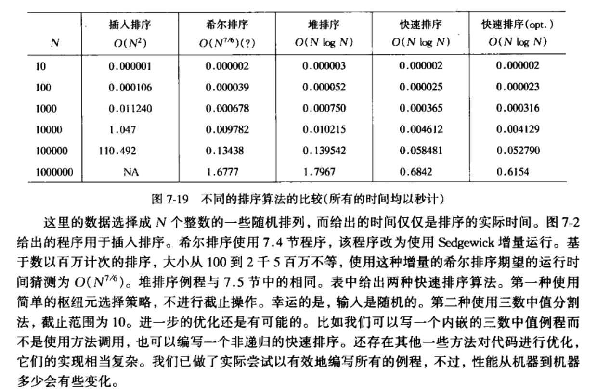

# 数据结构与算法分析_Java语言描述

# 第一章 引论

## 1.1 本书讨论内容

## 1.2 数学知识复习

### 1.2.1 指数

### 1.2.2 对数

### 1.2.3 级数

### 1.2.4 模运算

### 1.2.5 证明的方法

## 1.3 递归简论

- Java 提供的仅仅是遵循递归思想的一种尝试，不是所有的数学递归函数都能被有效地（或正确地）由 Java 的递归模拟来实现。
- Java 的递归方法若无基准情况是毫无意义的。
- 导致递归的四个个基本法则：
  1. 基准情形。（必须有某些基准情形，它们不用递归就能求解）
  2. 不断推进。（对于需要递归求解的情形，递归调用必须总能朝着一个基准情形推进）
  3. 设计法则。（假设所有的递归调用都能运行）
  4. 合成效益法则。（在求解一个问题的同一实例时，子恶恶在不同的递归调用中做重复性的工作）

## 1.4 实现泛型特性构件 pre-Java 5

- 面向对象的一个重要目标：对代码重用的支持。
- 支持该目标的一个重要机制：泛型。
- 1.5 版本以前，Java 并不直接支持泛型实现，泛型编程的实现是通过使用继承的一些基本概念来完成的。

### 1.4.1 使用 Object 表示泛型

两个细节考虑：

1. 为了访问这种对象的一个特定方法，必须要强制转换成正确的类型。
2. 不能使用基本类型。只有引用类型能与 Object 相容。

### 1.4.2 基本类型的包装

### 1.4.3 使用接口类型表示泛型

### 1.4.4 数组类型的兼容性

- 数组的协变性（covariant）：如果类Base是类Sub的基类，那么Base[]就是Sub[]的基类。
- 数组是协变的，而泛型是不可变（invariant）的。

数组的协变性可能会导致错误：

```java
public static  void main(String[] args) {    
        Object[] array = new String[10];
        array[0] = 10;
}
```

因为数组的协变性，他是可以通过编译的，Object[]类型的引用可以指向一个String[]类型的对象，但是运行时会报错，抛出如下异常：

```java
Exception in thread "main" java.lang.ArrayStoreException: java.lang.Integer
```

但是对于泛型就不会出现这种情况了：

```java
public static void main(String[] args) { 
        List< Object> list = new ArrayList< String>(); 
        list.add(10);
}
```

这段代码连便宜都不能通过。

> 数组是具体化的（reified），而泛型再运行时是被擦除的（erasure）。
>
> 数组是在运行时才去判断数组元素的类型约束，而泛型正好相反，在运行时，泛型的类型信息是会被擦除的，只有便宜的时候才会对类型进行强化。
>
> Java 泛型是编译器泛型，是一种语法糖，生成的二进制代码中是没有泛型的，jvm 感受不到泛型。Java 的泛型编译生成二进制代码的时候，进行了类型的擦除，放入集合的实际上是 Object 类型，从集合中获取对象的时候，获取的是 Object 类型，然后进行了强制类型转化，转换成实际的类型。

## 1.5 利用 Java 5 泛型实现泛型特性成分

### 1.5.1 简单的泛型类和接口

### 1.5.2 自动装箱/拆箱

自动装箱：一个 int 型变量被传递到需要一个 Integer 对象的地方，编译器将在幕后插入一个对 Integer 构造方法的调用。

自动拆箱：一个 Integer 对象被放到需要 int 类型变量的地方，编译器再幕后插入一个对 intValue 方法的调用。

### 1.5.3 带有限制的通配符

```java
public static double totalArea(Collection<? extends Shape> arr){
    double total = 0;
    for(Shape s : arr)
        if(s != null)
            total += s.srea();
    return total;
}
```

### 1.5.4 泛型 static 方法 ？

有时候特定类型很重要：

1. 该特定类型用作返回类型；
2. 该类型用在多于一个的参数类型中；
3. 该类型用于声明一个局部变量；

如果是这样，那么，必须要声明一种带有若干类型参数的显示泛型方法。

### 1.5.5 类型限界

```java
//在一个数组中找出最大元的泛型 static 方法
//public static <AnyType>
//public static <AnyType extends Comparable>
//public static <AnyType extends Comparable<AnyType>>
public static <AnyType extends Comparable<? super AnyType>> AnyType findMax(AnyType[] arr){
    int maxIndex = 0;
    for(int i = 1; i < arr.length; i++)
        if(arr[i].compareTo(arr[maxIndex]) > 0)
            maxIndex = i;
    return arr[maxIndex];
}
```

### 1.5.6 类型擦除

### 1.5.7 对于泛型的限制

- 基本类型

- instanceof 检测

- static 的语境
- 泛型类型的实例化

- 泛型数组对象

### 1.6 函数对象

函数对象：一个函数通过将其放在一个对象内部而被传递，这样的对象叫做函数对象。

# 第二章 算法分析

算法：是为了求解一个问题需要遵循的、被清楚指定的简单指令的集合。

## 2.1 数学基础

> 四个定义：
>
> 定义2.1：如果存在正常数 c 和 n 使得当 N>= n 时 T( N )<=cf( N )，则记为 T( N ) = O( f( N ) )。// 小于等于，传说中的大 O 标记发。
>
> 定义2.2：如果存在正常数 c 和 n 使得当 N>= n 时 T( N )>=cf( N )，则记为 T( N ) = Ω( f( N ) )。// 大于等于
>
> 定义2.3：T( N ) = θ( h( N ) ) 当且仅当  T( N ) = O( h( N ) ) 和 T( N ) = Ω( h( N ) )。// 等于
>
> 定义2.4：如果对每一常数 c 都存在常数 n 使得当 N>n 时 T( N )<cp( N )，则 T( N ) = o( p( N ) )。// 小于
>
> 比较的是相对增长率。
>

> 需要掌握的重要结论：
>
> 法则 1：
>
> 如果 T1( N ) = O( f( N ) ) 且 T2( N ) = O( g( N ) ) ，那么
>
> （a）T1( N ) + T2( N ) = O( f( N ) + g( N ) )（或非正式写成 max( O( f( N ) ) , O(g( N ) ) )）。
>
> （b）T1( N ) * T2( N ) = O( f( N ) * g( N ) )。
>
> 法则 2：
>
> 如果 $T~1( N ) $是一个 k 的多项式，则 $T( N ) = θ( N^k)$。
>
> 法则 3：
>
> 对任意常数 k，$log^kN = O(N)$。它告诉我们对数增长的非常缓慢。

## 2.2 模型

## 2.3 要分析的问题

## 2.4 运行时间计算

### 2.4.1 一个简单的例子

### 2.4.2 一般法则

- 法则 1：for 循环
- 法则 2：嵌套的 for 循环
- 法则 3：顺序语句
- 法则 4：if/else 语句

### 2.4.3 最大序列和问题的求解

算法 1：

算法 2：

算法 3：

算法 4：

```java
//最优算法 时间复杂度 O(N)
public static int maxSubSum4(int a[]){
    int maxSum = 0, thisSum = a[0];
    for(int j = 0; j < a.length; j++){
        thisSum += a[j];
        if(thisSum > maxSum)
            maxSum = thisSum;
        if(thisSum < 0) //字串和小于零，整个字串都是负收益，不要
            thisSum = 0;
    }
    return maxSum;
}
```


- 联机算法：如果数组在磁盘上或者通过互联网传送，那么他就可以被按顺序读入，在主存中不必存储数组的任何部分。不仅如此，在任意时刻，算法都能对它已经读入的数据给出子序列问题的正确答案。
- 仅需要常量空间并以线性时间运行的联机算法几乎是完美的算法。

### 2.4.4 运行时间中的对数

> 分析算法最混乱的方面大概集中在对数上。某些分治算法以 O( N log N ) 时间运行。
>
> 对数规律一般概括：如果一个算法用常熟时间（O( 1 )）将问题的大小削减为其一部分（通常是 1/2），那么该算法就是 O( log N )。另一方面，如果使用常数时间只是把问题减少一个常数的数量（如将问题减少 1 ），那么这种算法就是 O( N ) 的。

三个例子：

- 折半查找（binary search）

```java
public static <AnyType extends Comparable<? super AnyType>>
int binarySearch(AnyType a[], AnyType x){
    int low = 0, high = a.length-1;
    while (low <= high){
        int mid = (low + high)/2;
        if(a[mid].compareTo(x) > 0)
            high = mid-1;
        else if(a[mid].compareTo(x) < 0])
            low = mid+1;
        else
            return mid;
    }
    return -1;
}
```

- 欧几里得算法

```java
//假设m>=n，如果n>m，则循环第一次迭代将它们互换
public static long gcd(long m, long n){
    while(n!=0){
        long rem = m%n;
        m = n;
        n = rem;
    }
    return m;
}
```

> 算法连续计算余数直到余数是 0 为止，最后的非零余数就是最大公因数。
>
> 可以证明两次迭代以后，余数最多是原始值的一半，这就证明了迭代次数至多是 2 log N = O( log N )。证明如下：
>
> 定理：2.1 如果 M > N ，则 M mod N < M/2。
>
> 证明：存在两种情形。
>
> 1、如果 N <= M/2，余数小于 N，定理成立。
>
> 2、如果 N > M/2，余数为 M - N，也小于 M/2，定理得证。
>
> 更真实数据：
>
> 复杂度可以改进成 1.44logN，哦激励的算法迭代平均次数约为 $(12 ln2 lnN)/π^2+1.47$。

- 幂运算

> 有一种递归算法效果更好。
>
> 若 N 是偶数，$X^N=X^(N/2)·X^(N/2)$，
>
> 如果 N 是奇数，$X^N=X^(N/2)·X^(N/2)·X$。

```java
public static long pow(long x, long n){
    if(n == 0)
        return 1;
    if(n == 1)
        return x;
    if(isEven(n))
        return pow(x*x, n/2);
    else
        return pow(x*x, n/2)*x;
}
```

### 2.4.5 检验你的分析

### 2.4.6 分析结果的准确性

# 第三章 表、栈和队列

## 3.1 抽象数据类型

- 抽象数据类型（abstract data type， ADT）是带有一组操作的一些对象的集合。

## 3.2 表 ADT

> 形如 $A~0,A~1,···,A~(N-1)$ 的一般的表，我们说这个表的大小是 N。将大小为零的表成为空表。
>
> 前驱，后继概念。

### 3.2.1 表的简单数组实现

> 数组实现的表可以使打印操作以线性时间被执行，查找操作花费常数时间。
>
> 不过插入和删除的操作开销大，最坏情况 O( N )，最好 O( 1 )。

### 3.2.2 简单链表

> 链表一般想法：避免插入和删除的线性开销，可以不连续存储。
>
> 增删快，查询慢。
>
> 双链表概念。

## 3.3 Java Collections API 中的表

### 3.3.1 Collection 接口

扩展的 Iterable 接口，可以用增强 for 循环。

### 3.3.2 Iterator 接口

实现 Iterable 接口的集合必须提供一个称为 iterator 的方法，该方法返回一个 Iterator 类型的对象。该 Iterator 是一个在 java.util 包种定义的接口：

```java
public interface Iterator<AnyTupe>{
    boolean hsaNext();
    AnyType next();
    void remove();
}
```

> 与 Collection 的 remove 方法 相比，Iterator 的 remove 方法有更多的优点。
>
> 直接使用 Iterator（而不是通过一个增强的 for 循环间接使用） 时，基本法则：如果对正在被迭代的集合进行结构上的改变（即对该集合使用 add、remove 或 clear 方法），那么迭代器就不再合法（并且在其后使用该迭代器时将会有 VoncurrectModificationException 异常被抛出）。
>
> 只有在需要立即使用一个迭代器的时候，我们在应该获取迭代器。
>
> 如果迭代器调用了自己的 remove 方法，这个迭代器就仍然是合法的。

### 3.3.3 List 接口、ArrayList 类和 LinkedList 类

### 3.3.4 例：remove 方法对 LinkedList 类的使用

将一个表种所有具有偶数值的项删除：

```java
//第一种想法。
//在 ArrayList 上，remove 效率不高，花费二次时间
//LinkedList 暴露两个问题。get 效率不高，花费两次时间；remove 调用低效，因为达到位置 i的代价昂贵
public static void removeEvensVer1(List<Integer> lst){
    int i = 0;
    while(i < lit.size()){
        if(lst.get(i) % 2 == 0)
            lst.remove(i);
        else
            i++;
    }
}
//使用 Collection 的 remove 方法删除，这不是高效操作，因为 remove 方法必须再次搜索该项，花费线性时间。
//产生异常，因为当一项被删除时，由增强的 for 循环所使用的基础迭代器是非法的。
//ConcurrectModificationExeption 异常
public static void removeEvensVer2(List<Integer> lst){
    for(Integer x : lit)
        if(x % 2 == 0)
            lst.remove(x);
}
//一种成功的想法：迭代器
//LinkedList：remove 方法的调用花费常数时间，因为该迭代器位于需要被删除的节点（或在其附近）。整个程序是线性的，不是二次时间
//ArrayList： remove 方法昂贵，整个程序仍然花费二次时间
public static void removeEvensVer3(List<Integer> lst){
    Iterator<Integer> itr = lst.iterator();
    while(itr.hsaNext())
        if(itr.next() % 2 == 0)
            itr.remove();
}
```

### 3.3.5 关于 ListIterator 接口

## 3.4 ArrayList 类的实现

### 3.4.1 基本类

### 3.4.2 迭代器、Java 嵌套类和内部类

## 3.5 LinkedList 类的实现

## 3.6 栈 ADT

### 3.6.1 栈模型

> 栈（stack）是限制插入和删除只能在一个位置上进行的表，该位置是表的末端，叫做栈的顶（top）。栈有时叫做LIFO（后进先出）。
>
> 基本操作：push（进栈）和pop（出栈）。

### 3.6.2 栈的实现

#### 栈的链表实现

#### 栈的数组实现

### 3.6.3 应用

#### 平衡符号

> 做一个空栈。读入字符直接到文件结尾。如果字符是一个开放符号，则将其推入栈中。如果字符是一个封闭符号，则当栈空时报错。否则，将栈元素弹出。如果弹出的符号不是对应的开放符号，则报错。在文件结尾，如果栈非空则报错。

#### 后缀表达式

```java
4*2+5+6*2=
4 2 * 5 + 6 2 * +
```

> 计算这个问题最容易的方法是使用一个栈。当见到一个数时就把他推入栈种；在遇到一个运算符时该运算符就作用于从该栈弹出的两个数上没在将结果推入栈栈中。
>
> 计算一个后缀表达式话费的时间是 O（N），因为对输入中的每个元素的处理都是由一些栈操作组成从而花费常数的时间。
>
> 当一个表达式以后缀记号给出时，没有必要知道任何有限的规则，这是一个明显的优点。

#### 中缀到后缀的转换

```java
/*
具体转换方式：
1.从左到右进行遍历
2.运算数,直接输出
3.左括号,直接压入堆栈,(括号是最高优先级,无需比较)(入栈后优先级降到最低,确保其他符号正常入栈)
4.右括号,(意味着括号已结束)不断弹出栈顶运算符并输出直到遇到左括号(弹出但不输出)
5.运算符,将该运算符与栈顶运算符进行比较,
如果优先级高于栈顶运算符则压入堆栈(该部分运算还不能进行),
如果优先级低于等于栈顶运算符则将栈顶运算符弹出并输出,然后比较新的栈顶运算符.
(低于弹出意味着前面部分可以运算,先输出的一定是高优先级运算符,等于弹出是因为同等优先级,从左到右运算)直到优先级大于栈顶运算符或者栈空,再将该运算符入栈.
6.如果对象处理完毕,则按顺序弹出并输出栈中所有运算符

后缀表达式运算步骤：
(以堆栈储存)
从左到右,遇到运算符就弹出相应的运算数,运算后再把结果入栈.最终结果就是栈顶数的值.
(由于该运算为线性结构,具体运算时是不需要储存输出后的运算符,一般是输出一个运算符就进行一次运算,不像图中要储存输出状态.)

注意点：
有时候’-’(负号)是单目运算符,则要修改运算数.遇到其他运算符(如幂运算)也类似.
*/
```


#### 方法调用

**活动记录或栈帧**的概念，**尾递归**概念

尾递归总能够被彻底去除（编译器是在转变成汇编语言时完成递归去除的），某些编译器可以自动完成。一般方法是要求使用一个栈，而且仅当你能够把最低限度的最小值放到栈上时这个方法才值得一用。

## 3.7 队列 ADT

队列（queue）也是表，使用队列时插入在一段进行而删除则在另一端进行。

### 3.7.1 队列模型

基本操作：

入队（enqueue）：在表的末端（叫做队尾（rear））插入一个元素。

出队（dequeue）：删除（并返回）在表的开头（叫做对头（front））的元素。

### 3.7.2 队列的数组实现

### 3.7.3 队列的应用

# 第四章 树

## 4.1 预备知识

树（tree）的几种定义方式。其中一种是递归的方式。

树是一些节点的集合。这些集合可以是空集；若不是空集，则由称作根（root）的节点的 r 以及 0 个或多个非空的子树组成，这些子树中每一颗的根都被来自根 r 的一条有向的边（dege）所连结。

根节点，子节点概念。没有儿子的节点称为树叶（leaf）；具有相同父亲的节点称为兄弟（siblings）；

### 4.1.1 树的实现

```java
//向下箭头指向 firstChild(第一个儿子) 的链，而水平箭头是指向 nextSibling(下一兄弟)的链。
class TreeNode{
    Object element;
    TreeNode firstChild;
    TreeNode nextSibling;
}
```


### 4.1.2 树的遍历及应用

UNIX 文件系统目录遍历伪代码：

//输出格式：深度为 $d~i$ 的文件将被 $d~i$ 次跳格（tab）缩进后打印其名。

```java
private void listAll(int depth){
    pringName(depth); // Print the name of the object
    if(isDirectory()){
        for each file c in this directory (for each child)
            c.listaAll(depth+1);
    }
    public void listAll(){
        listAll(0);
    }
}
```

先序遍历：对节点的处理工作是在他的诸儿子节点被处理之前进行的。运行时间是 O（N）。

后序遍历：对节点的处理工作是在他的诸儿子节点被处理之后进行的。

//计算被该树所有文件占用的磁盘区块总数

```java
public int size(){
    int totalSize = sizeOfThisFile();
    if (isDirectory()){
        for each file c in this directory(for each child)
            totalSize += c.size();
    }
    return totalSize;
}
```

## 4.2 二叉树

**二叉树**（binary tree）是一颗树，集中每个节点不能有多余两个的儿子。

二叉树的一个性质是一颗平均二叉树的深度要比结点个数 N 小很多，这个性质有时很重要。分析表明，平均深度为$O(\sqrt{N})$，查找二叉树（binary search tree）深度的平均值是$O(logN)$。最坏情形二叉树深度为 N-1。

4.2.1 实现

```java
//二叉树节点类
class BinaryNode{
    Object element;		//The data in the node
    BinaryNode left;	//Left child
    BinaryNode right;	//Right child
}
```

### 4.2.2 例子：表达式树

中序遍历：左，根，右。得到一个中缀表达式。

后序遍历：左，右，根。得到一个后缀表达式。

先序遍历：根，左，右。不太常用的前缀表达式。

#### 构造表达式树

一次一个符号地读入表达式。如果符号是操作数，就建立一个单节点树并将它推入栈中。如果是操作符，就从栈中弹出两棵树 $T~2$ 和 $T~1$ （$T~2$ 先弹出）并形成一棵新树，该树的根就是操作符，他的左右儿子分别是$T~1$ 和 $T~2$，然后将这棵树压入栈中。

## 4.3 查找树 ADT--二叉查找树

使二叉树成为二叉查找树的性质是，对于树中的每个节点 X，它的左子树中所有项的值小于 X 中的项，而它右子树中所有的项的值大于 X 中的项。

```java
private static class BinaryNode<AnyType>{
    //Constructors
    BinaryNode(AnyType theElement){
        this(theElement, null, null);
    }
    BinaryNOde(AnyType theElement, BinaryNode<AnyType>lt, BinaryNode<AnyType>rt){
        element = theElement;
        left = lt;
        right = rt;
    }
    AnyType element;	//The data in the node
    BinaryNode<AnyType> left;	//left child
    BinaryNode<AnyType> right;	//right child
}
```

```java
public class BinarySearchTree<AnyType extends Comparable<? super AnyType>>{
    private static class BinaryNode<AnyType>{}
    private BinaryNode<AnyType> root;
    public BinarySearchTree(){
        root = null;
    }
    public void makeEmpty(){
        root = null;
    }
    public boolean isEmpty(){
        return root == null;
    }
    public boolean contains(AnyType x){
        return contains(x, root);
    }
    public ANyType findMin(){
        if(isEmpty()) throw new UnderflowException();
        return findMin(root).element;
    }
    public ANyType findMax(){
        if(isEmpty()) throw new UnderflowException();
        return findMax(root).element;
    }
    public void insert(AnyType x){
        root = insert(x, root);
    }
    public void remove(AnyType x){
        root = remove(x, root);
    }
    public void printTree(){}
    private boolean contains(AnyType x, BinarryNode<AnyType> t){}
    private BinaryNOde<AnyType> findMin(BinaryNode<AnyType> t){}
    private BinaryNOde<AnyType> findMax(BinaryNode<AnyType> t){}
    private BinaryNode<AnyType> insert(AnyType x, BinaryNode<AnyType> t){}
    private BinaryNode<AnyType> remove(AnyType x, BinaryNode<AnyType> t){}
    private void printTree(BinaryNode<AnyType> t){}
}
```

### 4.3.1 contains 方法

```java
private bollean contains(AnyType x, BinaryNOde<AnyType> t){
    if(t == null)
        return false;
    int compareResult = x.compareTo(t.element);
    if(compateResult<0)
        return contains(x, t.left);
    else if(compateResult>0)
        return contains(x, t.right);
    else
        return true;
}
```

#### （？？？没看懂）需要使用一个函数对象而不是要求这些项是 Comparable 的。

```java
public class BinarySearchTree<AnyType>{
    private BinaryNode<AnyType> root;
    private Comparator<? super ANyType> cmp;
    public BinarySearchTree(){
        this(null);
    }
    public BinarySearchTree(Comparator<? super AnyType> c){
        root = null;
        cmp = c;
    }
    private int myCompare(AnyType lhs, ANyType rhs){
        if(cmp != null)
            return cmp.compare(lhs, rhs);
        else
            return ((Comparable)lhs.compareTo(rhs));
    }
    private bollean contains(AnyType x, BinaryNOde<AnyType> t){
    if(t == null)
        return false;
    int compareResult = myCompare(x, t.element);
    if(compateResult<0)
        return contains(x, t.left);
    else if(compateResult>0)
        return contains(x, t.right);
    else
        return true;
    } 
}
```

### 4.3.2 findMin 方法和 findMax 方法

递归和非递归两种方式

```java
private BinaryNode<AnyType> findMin(BinaryNode<AnyType> t){
    if(t == null)
        return null;
    else if(t.left == null)
        return t;
    return findMin(t.left);
}
private BinaryNode<AnyType> findMax(BinaryNode<AnyType> t){
    while(t!=null)
        t=t.right;
    return t;
}
```

### 4.3.3 insert 方法

将元素插入到二叉树的例程

```java
private BinaryNode<AnyType> insert(AnyType x, BinaryNode<AnyType> t){
    if(t == null)
        return new BinaryNode<AnyType>(x, null, null);
    int compareResult  = x.compareTo(t.element);
    if(compareResult<0)
        t.left = insert(x, t.left);
    else if (compareResult>0)
        t.right = insert(x, t.right);
    else
        //Duplicate; do nothing
    return t;
}
```

### 4.3.4 remove 方法

一般的删除策略是用其右子树的最小的数据代替该节点的数据并递归地删除那个节点。

如下程序完成删除工作，但是效率并不高，因为它沿该树进行两趟搜索以查找和删除右子树中最小的节点。通过写一个特殊的 removeMin 方法可以容易地改变这种效率不高的缺点，这里略去只是为了简明。

```java
private BinaryNode<AnyType> remove(AnyType x, BinaryNode<AnyType> t){
    if(t == null)
        return t; //Item not found; do nothing
    int compareResult = x.compareTo(t.element);
    if(compareResult<0)
        t.left = remove(x, t.left)
    else if(compareResult>0)
        t.right = remove(x, t.right);
    else if(t.left!=null && t.right!=null){//Two children
        t.element = findMin(t.right).element;
        t.right = remove(t.element, t.right);
    }
    else
        t = (t.left!=null)?t.left:t.right;
    return t;
}
```

### 4.3.5 平均情况分析

证明，假设所有的插入序列都是等可能的，则书的所有节点的平均深度为 O（log N）。

我没看。。。

## 4.4 AVL 树

> AVL 树是带有平衡条件的二叉树。这个平衡条件必须要容易保持，而且保证树的深度必须是O（log N）。
>
> 一棵 AVL 树是其每个节点的左子树和右子树的高度最多差 1 的二叉查找树（空树的高度定义为 -1）。可以证明，粗略地说，一个 AVL 树的高度最多为 1.44 log（N+2）-1.328，但是实际上的高度只略大于 log N。
>
> 在高度为 h 的 AVL 树中，最少节点数 S( h )=S( h-1 )+S( h-2 )+1。函数 S（h）与斐波纳契数密切相关，由此退出上面提到的关于 AVL 树的高度的界。
>
> 插入操作可能破坏平衡特性，这总可以通过**旋转**来修正。

更新平衡信息：找到第一个破坏平衡条件的节点，重新平衡这棵树。

平衡节点叫 α。由于任意节点最多有两个儿子，因此出现高度不平衡就需要 α 点的两颗子树的高度差 2。不平衡四种情况：

1. 对 α 的左儿子的左子树进行一次插入
2. 对 α 的左儿子的右子树进行一次插入
3. 对 α 的右儿子的左子树进行一次插入
4. 对 α 的右儿子的右子树进行一次插入

1 和 4 对称，2 和 3 对称。两种情况。第一种情况（外面，左-左或右-右）**单旋转**，第二种情况（内部，左-右或右-左）**双旋转**。

### 4.4.1 单旋转

- 左左插入，向右单旋转。
- 右右插入，向左单旋转。

注意：树的其余部分必须被告知该变化。


### 4.4.2 双旋转

AVL 树的节点声明：

```java
//AVL 树的节点声明
private static class AvlNode<AnyType>{
    //Constructors
    AvlNode(AnyType theElement){
        this(theElement, null, null);
    }
    AvlNode(AnyType theElement, AvlNode<AnyType> lt, AvlNode<AnyType> rt){
        element = theElement;
        left = lt;
        right = rt;
        height = 0;
    }
    AnyType element;		//The data in the node
    AvlNode<AnyType> left;	//Left child
    AvlNode<AnyType> right;	//Right child
    int height;				//Height
    private int height(AvlNode<AnyType> t){
        return t == null?-1:t.height;
    }
}
```

向 AVL 树的插入历程：

```java
//向 AVL 树的插入历程
private AvlNode<AnyType> insert(AnyType x, AvlNode<AnyType> t){
    if(t == null)
        return new AvlNode(x, null, null);
    int compareResult = compare(x, t.element);
    if(compareResult<0){//左
        t.left = insert(x, t.left);
        if(height(t.left)-height(t.right) == 2){//平衡被破坏
            if(compare(x, t.left.element)<0){//左左插入 向右单旋转
                t = rotateWithLeftChild(t);
            }else {//左右 双旋转
                t = doubleWithLeftChild(t);
            }
        }
    }else if(compareResult>0){//右
        t.right = insert(x, t.right);
        if(height(t.right)-height(t.left) == 2){//平衡被破坏
			if(compare(x, t.right.element)<0){//右右插入 向左单旋转
                t = rotateWithRightChild(t);
            }else {//右左 双旋转
                t = doubleWithRightChild(t);
            }	            
        }
    }else{
        ;//Duplicate; do nothing
    }
    t.heitht = Math.max(height(t.left),height(t.right))+1;
    return t;
}
```

执行单旋转的历程：

```java
//执行单旋转的历程 左左插入，向右单旋转。
private AvlNode<AnyType> rotateWithLeftChild(AvlNode<AnyType> k2){
    AvlNode<AnyType> k1 = k2.left;
    k2.left = k1.right;
    k1.right = k2;
    k2.heihgt = Math.max(height(k2.left), height(k2.right))+1;
    k1.heihgt = Math.max(height(k1.left), height(k1.right))+1;
    return k1;
}
```

```java
//执行单旋转的历程 右右插入，向左单旋转。
private AvlNode<AnyType> rotateWithRightChild(AvlNode<AnyType> k1){
    AvlNode<AnyType> k2 = k1.right;
    k1.right = k2.left;
    k2.left = k1;
    k1.height = Math.max(height(k1.left), height(k1.right))+1;
    k2.heihgt = Math.max(height(k2.left), height(k2.right))+1;
    return k2;
}
```

执行双旋转的例程：

```java
//执行双旋转的例程 左右插入 左儿子先左旋转自己后右旋转
private AvlNode<AnyType> doubleWithLeftChild(AvlNode<AnyTyp> k3){
    k3.left = rotateWithRightChild(k3.left);
    return rotateWithLeftChild(k3);
}

```

```java
//执行双旋转的例程 右左插入 右儿子先右旋转自己后左旋转
private AvlNode<AnyType> doubleWithLeftChild(AvlNode<AnyTyp> k1){
    k1.right = rotateWithLeftChild(k1.right);
    return rotateWithRightChild(k1);
}
```

## 4.5 伸展树

特性：保证从空树开始连续 M 次对树的操作做多花费 O( M log N) 时间。

基本想法：当一个节点被访问后，它就要经过一系列 AVL 树的旋转被推到根上。

### 4.5.1 一个简单的想法（不能直接使用）

从底向上进行单旋转。

### 4.5.2 展开

令 X 是在访问路径上的一个（非根）节点，我们将在这个路径上实施旋转操作。如果 X 的父节点是树根，那么只要旋转 X 和树根。这就是沿着访问路径上的最后的旋转。否则，X 就有父亲（P）和祖父（G），存在着两种情况以及对称的情况要考虑。第一种情况是之字形（zig-zag）情形。这里，，X 是右儿子的形式，P是左儿子的形式（反之亦然）。如果这种情况，执行一次就像 AVL 双旋转那样的双旋转。否则，出现另一种一字形（zig-zig）情形：X 和 P 或者都是左儿子，或者其对称的情形，X 和 P 都是右儿子。这种情况下，我们把左边的树换成右边的树。


## 4.6 树的遍历

中序遍历，左根右，总运行时间为 O（N）。

```java
//中序遍历
public void printTree(){
    if(isEmpty())
        System.out.print("Empty tree");
    else
        printTree(root);
}
public void printTree(BinaryNOde<AnyType> t){
    if(t!=null){
        printTree(t.left);
    	System.out.print(t.element);
    	printTree(t.right);
    }
}
```

后序遍历，左右根，计算高度，总运行时间为 O（N）。

```java
//计算高度方法
private int height(BinaryNOde<AnyType> t){
    if(t == null)
        return -1;
    else
        return 1 + Math.max(height(t.left), height(t.right);
}
```

先序遍历，根左右，如果要用其深度标记每一个节点，那么这种遍历就会用到。

层序遍历，在层序遍历中，所有深度为 d 的节点要在深度 d+1 的几点处理之前进行处理。层序编列与其他类型的遍历不通的地方在于他不是递归执行的；他用到对垒，而不是用递归锁默示的栈。

## 4.7 B 树

主存装不下所有数据，把数据放到磁盘上。想要把磁盘访问次数减小到一个非常小的数，宁愿写一个复杂的程序来做这件事，因为在合理情况下机器指令基本是不占时间的。

增加分支，M 叉树。在 M 叉树中需要 M-1 个关键字来决定选取哪个分支。

B 树。这里描述基本的 B 树（B+树）。

阶为 M 的 B 树是一颗具有下列特征的树：（3 和 5 对前 L 次插入必须要放宽）

1. 数据项存储在树叶上。
2. 非叶节点存储直到 M-1 个关键字以指示搜索的方向；关键字 i 代表子树 i+1 中的最小的关键字。
3. 树的根或者是一片树叶，或者其儿子数在 2 和 M 之间。
4. 除根外，所有非树叶节点的儿子数在 M/2 和 M 之间。
5. 所有的树叶都在相同的深度上并有 L/2 和 L 之间个数据项。

插入：

···

删除：

···

## 4.8 标准库中的集合与映射

### 4.8.1 关于 Set 接口

Set 接口代表不允许重复元素的 Collection。

### 4.8.2 关于 Map 接口

Map 是一个接口，代表由关键字以及它们的值组成的一些项的集合。关键字必须是唯一的，值不必唯一。

### 4.8.3 TreeSet 和 TreeMap 类的实现

Java 要求 TreeSet 和 TreeMap 支持基本的 add、remove 和 contains 操作以对数最坏情形时间完成。因此，基本实现方法就是平衡二叉查找树。一般来说，不使用 AVL 树，经常用一些自顶向下的红黑树。

实现 TreeSet 和 TreeMap 的一个重要问题是提供对迭代器类的支持。在内部，迭代器保留到迭代中当前结点的一个链接。困难部分是到下一个节点高效的推进。

几种解决方案叙述：

12345

### 4.8.4 使用多个映射的例

计算包含单词作为关键字及只有一个字母不同的一列单词作为值的映射函数。对一个 89000 单词的词典只运行四秒钟。

```java
//检测两个单词是否只在一个字幕上不同
private static boolean oneCharDff(String word1, String word2){
    if(word1.length() != word2.length())
        return false;
    int diffs = 0;
    for(int i = 0; i < word1.length(); i++){
        if(word1.charAt(i) != word1.charAt(i))
            if(++diffs > 1)
                return false;
    }
    return true;
}
//更新Map对象
private static <KeyType> void update(Map<KeyType, List<String>> m, KeyType key, String value){
    List<String> lst = m.get(key);
    if(lst = null){
        lst = new ArrayList<String>();
        m.put(key, lst);
    }
    lst.add(value);
}
//用 TreeMap 实现一个复杂度为 O(N log N)的算法
public static Map<String, List<String>> computeAdjacentWords(List<String> words){
    Map<String, List<String>> adjWords = new TreeMap<String, List<String>>();
    Map<String, List<String>> wordsByLength = new TreeMap<Integer, List<String>>();
    //根据单词字母数分组，key 为单词长度，value 为该长度的单词list
    for(String w : words)
        update(wordsByLength, w.length(), w);
    //从每组开始分
    for(Map.Entry<Integer, List<String>> entry : wordsByLength.entrySet()){
        List<String> groupWords = entry.getValue();
        int groupNum = entry.getKey();
        //每个位置，从第一个字母到最后一个字母
        for(int i = 0; i < groupNum; I++){
            //删除第i个字母，将key和value存入map
            Map<String, List<String>> repToWord = new TreeMap<String, List<String>>();
            for(String str : goupsWords){
                string rep = str.substring(0, i) + str.substring(i+1);
                update(repToWord, rep, str);
            }
            //分组，在去掉一个字母相同的单词list中，生成最终的map
            for(List<String> wordClique : repToWord.values())
                if(wordClique.size() >= 2)
                    for(String s1 : wordClique)
                        for(String s2 : wordClique)
                            if(s1 != s2)
                                update(adjWords, s1, s2);
        }
    }
    return adjWords;
}
```

# 第五章 散列

散列表的实现常常叫做**散列**（hashing）。散列是一种用于以常数平均时间执行插入、删除和查找的技术。但是，哪些需要元素之间任意排序信息的树操作将不会得到有效的支持。

## 5.1 一般想法

理想的散列表数据结构是一个包含一些项（item）的具有固定大小的数组。通常，查找是对项的某个部分进行的，这部分叫做**关键字**（key）。表的大小记作 TableSize。每个关键字被映射到从 0 到 TableSize-1 这个范围中的某个数，并且被放到适当的单元中。这个映射就叫做散列函数（hash function）。这就是散列的基本想法。剩下的就是选择一个函数，决定当两个关键字散列到同一个值的时候（冲突（collision））应该做什么以及如何确定散列表的大小。

## 5.2 散列函数

如果输入的关键字是整数，则一般合理的方法就是直接返回 key mod tablesize。表的大小通常是素数。

通常，关键字是字符串。

一种方法是把字符串中字符的 ASCII 码（或 Unicode 码）值加起来：

```java
//表很大，函数将不会很好地分配关键字。假设 TableSize = 10007，并设所有关键字至多 8 个字符。散列函数只能假设值在 0-1016 之间。1016为127*8
public static int hash(String key, int tableSize){
    int hashVal = 0;
    for(int i = 0; i < key.length(); i++){
        hashVal += key.charAt(i);
    }
    return hashVal % tableSize;
}
```

另一个散列函数：

```java
//假设 key 至少有 3 个字符。27 代表26个英文字母外加一个空格的个数，729 为 27 的平方。该函数只考察签单个字符，如果它们是随机的，表大小还是 10007，会得到一个合理地均衡分布。但是前三个字母的组合不是随机的。
public static int hash(String key, int tableSize){
    return (key.charAt(0) + 27*key.charAt(1) + 729*key.charAt(2)) % tableSize;
}
```

一个好的散列函数：

$\sum_{i=0}^{SeySize-1}Key[SeySize-i-1]*37^i$

这个散列函数利用到事实：允许溢出

```java
//
public static int hsah(String key, int tableSize){
    int hashVal = 0;
    for(int i = 0; i < key.length(); i++){
        hashVal += 37*hashVal + key.charAt(i);
    }
    hashVal %= tableSize;
    if(hashVal < 0)
        hashVal += tableSize;
    return hashVal;
}
```

解决冲突的两种简单方法：分离链接法和开放定址法。

## 5.3 分离链接法

将散列到同一个值的所有元素保留到一个表中。

```java
//分离链接散列表的类架构
public class SeparateChainingHashTable<AnyType>{
    
    private static final int DEFAULT_TABLE_SIZE = 101;
    private List<AnyType> theLists[];
    private int currentSize;
    
    //无参构造
    public SeparateChainingHashTable(){
        this(DEFAULT_TABLE_SIZE);
    }
    //有参构造
    public SeparateChainingHashTable(int size){
        theLists = new LinkedList[nextPrime(size)];
        for(int i = 0; i < theLists.length; i++ )
            theLists[i] = new LinkedList<AnyType>();
    }
    //散列函数
    private int myhash(AnyType x){
        int hashVal = x.hashCode();
        hashVal %= theLists.length;
        if(hashVal < 0)
            hashVal += theLists.length;
        return hashVal;
    }
    //将散列表置空
    public void makeEmpty(){
        for(int i = 0; i < theLists.length; i++)
            theLists[i].clear();
        theSize = 0;
    }
    
    public boolean contains(AnyType x){
        List<AnyType> whichList = theLists[myhash(x)];
        return whichList.contains(x);
    }
    
    public void insert(AnyType x){
        List<AnyType> whichList = theLists[myhash(x)];
        if(!whichList.contains(x)){
            whichList.add(x);
            //Rehash
            if(++currentSize > theLists.length)
                rehash();
        }
    }
    
    public void remove(AnyType x){
        List<AnyType> whichList = theLists[myhash(x)];
        if(!whichList.contains(x)){
            whichList.remove(x);
            currentSize--;
        }
    }
    
    
    private void rehash(){
        
    }
    
    //求至少等于n的质数
    private static int nextPrime(int n){
        if(n%2 == 0)
            n++;
        for(; !isPrime(n); n+=2){}
        return n;
    }
    //判断一个数是否是质数
    private static boolean isPrime(int n){
        if(n == 2 || n == 3)
            return true;
        if(n == 1 || n%2 == 0)
            return false;
        for(int i = 3; i*i <= n; i+=2){
            if(n%i == 0)
                return false;
        }
        return true;
    }
```

本章的散列表只对遵守确定协议的那些对象工作。这些对象必须提供适当的 equals 方法和返回一个 int 型量的 hashCode 方法，此时，散列表把这个 int 型量通过 myHash 转成适当的数组下标。

```java
private int myhash(AnyType x){
    int hashVal = x.hashCode();
    hashVal %= theLists.length;
    if(hashVal < 0)
        hashVal += theLists.length;
    return hashVal;
}
```

可以放在一个散列表中的 Employee 类的例子：

```java
public class Employee{
    public boolean equals(Object rhs){
        return (rhs instanceof Empoyee && name.equals(((Employee)rhs).name));
    }
    public int hashCode(){
        return name.hashCode();
    }
    private String name;
    private double salary;
    private int seniority;
    
    // Additional fields and methods
}
```

我们定义散装因子 λ 为散列表中的元素个数对该表大小的比。散列表的大小实际并不重要，而填装因子才是重要的。分离链接散列法的一般法则是使得表的大小与预料的元素各处大致相等（换句话说，让  λ≈1）。

## 5.4 不用链表的散列表

分离链接散列算法的缺点是使用一些链表。由于给新单元分配地址需要时间（特别是在其他语言中），因此导致算法的速度有些缓慢，同时算法实际上还要求对第二种数据结构的实现。

另有一种不用链表解决冲去的方法是常事另外一些单元，直到找出空的单元为止。单元 $h_0(x)$, $h_1(x)$, $h_2(x)$,···相继被试选，其中 $h_i(x)=(hash(x)+f(i))mod\ \ \ TableSize$  ，且 f（0）= 0。函数 f 是冲突解决方法。因为所有的数据都要置入表内，所以这种解决方案所需要的表要比分离链接散列的表大。一般说来，对于不是用分离链接的散列表来说，其填装因子应该低于 λ=0.5。我们把这样的表叫做探测散列表。

### 5.4.1 线性探测法

函数 f 是 i 的线性函数，典型的情形是 f（i） = i。

一次聚集（primary clustering）。

### 5.4.2 平方探测法

平方探测是消除线性探测中一次聚集问题的冲突解决方法。平方探测就是冲突函数为二次的探测方法。流行的选择是 $f(x)=i^2$。

一旦表被填充超过一半，当表的大小不是素数时甚至在被填充一半之前，就不能保证一次找到空的单元了。

可以证明，使用平方探测，并且表的大小是素数，当表至少有一半是空的时候，总能够插入一个新的元素。

在探测散列表中标准的删除操作不能执行，因为相应的单元可能已经引起过冲突，元素绕过它存在了别处。因此，探测散列表需要懒惰删除，不过在这种情况下实际上并不存在所意味的懒惰。

实现探测散列表需要的类架构。这里，不用链表数组，使用散列表项单元：

```java
public class QuadraticProbingHashTable<AnyType>{
    //无参构造
    public QuadraticProbingHashTable(){
    	this(DEFAULT_TABLE_SIZE);
    }
    //有参构造
    public QuadraticProbingHashTable(int size){
    	allocateArray(size);
        makeEmpty();
    }
    //使哈希表在逻辑上为空
    public void makeEmpty(){
    	currentSize = 0;
        for(int i = 0; i<array.length; i++)
            array[i] = null;
    }
    
    public boolean contains(AnyType x){
    	int currentPos = findPos(x);
        return isActive(currentPos);
    }
    
    public void insert(AnyType x){
    	int currentPods = findPods(x);
        if(isActive(currentPods))
            return;
        array[currentPods] = new HashEntry(x, true);
        if(++currentSize > array.length/2)
            rehash();
    }
    
    public void remove(AnyType x){
    	int currentPods = findPods(x);
        if(isActive(currentPods))
            array[currentPods].isActive = false;
    }
    
    private static class HashEntry<AnyType>{
    	public AnyType element; // the element
        public boolean isActive; // false if marked deleted
        public HashEntry(AnyType e){
        	this(e, true);
        }
        public HashEntry(AnyType e, boolean i){
            element = e;
            isActive = i;
        }
    }
    
    private static final int DEFAULT_TABLE_SIZE = 11;
    private HashEntry<AnyType> array[]; // The array of elements
    private int currentSize;
    
    private void allocateArray(int arraySize){
    	array = new HashEntry[arraySize];
    }
    
    private boolean isActive(int currentPos){
    	return array[currentPos] != null && array[currentPos].isActive; 
    }
    
    private int findPos(AnyType x){
    	int offset = 1;
        int currentPods = myhash(x);
        while(array[currentPods]!=null && !array[currentPods].element.equals(x)){
            currentPods += offset; //加上offset跳到下一个位置
            offset += 2;	//偏移量 0 1 4 9 16 差距是 1 3 5 7
            if(currentPods >= array.length)
                currentPods -= array.length;
        }
        return currentPods;
    }
    
    private void rehash(){
    	
    }
    
    private int myhash(AnyType x){
    
    }
    
    private static int nextPrime(int n){
    	
    }
    
    private static boolean isPrime(int n){
    	
    }
}
```

平方探测排除了**一次聚集**，但是产生了**二次聚集**（单列到同一位置上的那些元素将探测相同的备选单元）。每次查找，一般要引起另外少于一半的探测。排除这个缺憾，需要付出计算一个附加的散列函数。

### 5.4.3 双散列

双散列（double hashing）。一种流行的选择是 $f(i) = i·hash_2(x)$。

函数选择很重要；保证所有的单元都能被检测到也很重要（tableSize 为素数）。例如 $hash_2 = R-(x mod R)$。

## 5.5 再散列

再散列：建立新表，扫描原来的表，把数据全部插入到新表中。

实现方式：

1. 表满到一半时。
2. 表插入失败时。
3. 途中策略：当散列表达到某一个填装因子时进行再散列（比较好）。

对分离链接散列表和探测散列表的再散列：

```java
//终于要出场的 rehash
private void rehash(){
	HashEntry<AnyType> oldArray[] = array;
    allocateArray(nextPrime(2*oldArray.length));
    currentSize = 0;
    for(int i = 0; i < oldArray.length; i++){
    	if(oldArray[i]!=null && oldArray[i].element.isActive)
            insert(oldArray[i].element);
    }
}
private void rehash(){
	List<AnyType> oldList[] = theLists;
    theLists = new List[nextPrime(2*oldArray.length)];
    for(int j = 0; j< theLists.length; j++)
        theLists[j] = new LiinkedList<AnyType>();
    currentSize = 0;
    for(int i = 0; i<oldLists.length; i++)
        for(AnyType item : oldLists[i])
            insert(item);
}
```

## 5.6 标准库中的散列表

标准库包括 Set 和 Map 的散列表的实现，即 HashSet 类和 HashMap 类。HashSet中的项（或HashSet中的关键字）必须提供 equals 方法和 HashCode 方法。HashSet 和 HashMap 通常是用分离链接散列实现的。

HashMap 的性能常常优于 TreeMap 的性能。因此，在 HashMap 或 TreeMap 可以接受的情况下，更可取的方法是：使用接口类型 Map 进行变量的声明，然后将 TreeMap 的实例变成 HashMap 的实例并进行计时测试。

在 Java 中，能够被合理地插入到一个 HashSet 中去或是所谓关键字被插入到 HashMap 中去的那些类库类型已经被定义了 equals 和 HashCode 方法。

散列表操作中费时多的部分就是计算 hashCode 方法，每个String 类对象内部都存储他的hashCode 值。该值初始值为 0，但若 HashCode 被调用，那么这个值就会被记住。因此，如果hashCode 对同一个String 对象被第二次计算，可以避免昂贵的重新计算。这个技巧叫做**闪存散列代码**，并且表示另一种经典的是空交换。

```java
public final class String{
	public int hashCode(){
    	if(hash != 0)
            return hash;
        for(int i = 0; i < length(); i++;)
            hash = hash * 31 + (int)charAt(i);
        return hash;
    }
    private int hash = 0;
}
```

## 5.7 可扩散列

**可扩散列**（extendible hashing），它使得用两次磁盘访问执行一次查找。插入操作也需要很少的磁盘访问。

···

# 第六章 优先队列（堆）？？？

优先队列（priority queue）。

## 6.1 模型

优先队列是允许至少下列两种操作的数据结构：insert（插入），它的作用是显而易见的；以及 deleteMin（删除最小者），他的工作是找出、返回并删除优先队列中最小元素。insert 操作等价于 enqueue（入队），而 deleteMin 则是队列运算 dequeue（出队）在有限队列中的等价操作。

## 6.2 一些简单的实现

## 6.3 二叉堆

二叉堆（binary heap）。

### 6.3.1 结构性质

堆是一颗被完全填满的二叉树，有可能的例外是在底层，底层上的元素从左到右填入。这样的树称为完全二叉树（complete binary tree）。

容易证明，一颗高为 h 的完全二叉树有 $2^h$ 到 $2^{h+1}-1$ 个节点。这意味着完全二叉树的高是 log N。

完全二叉树可以用数组表示。数组下标从 1 开始，对于数组中任意位置 i 上的元素，其左儿子在位置 2i 上，右儿子在左儿子后的单元（2i + 1）上，它的父亲则在位置 i/2 上。这种实现方法唯一的问题在于，最大的堆大小需要事先估计，但一般这并不成问题（而且如果需要，我们可以重新调整大小）。

```java
//优先队列的类架构
public class BinaryHeap<AnyType extends Comparable<? super AnyType>>{
	public BinaryHeap(){
    	this(DEFAULT_CAPACITY);
    }
    
    public BinaryHeap(int capacity){
    	currentSize = 0;
        array = (AnyType[]) new Coparable[capacity+1];
    }
    
    public BinaryHeap(AnyType items[]){
    	currentSize = items.length;
        array = (AnyType[])new Comparable[(currentSize+2)*11/10];
        int i = 1;
        for(AnyType item : items)
            array[i++] = item;
        buildHeap();
    }
    
    public void insert(AnyType x){
        if(currentSize == array.length-1)
            enlargeArray(array.length*2+1);
        
    	int hole = ++currentSize;
        for(; hole>1 && x.compareTo(array[hole/2])<0; hole/=2)
            array[hole] = array[hole/2];
        array[hole] = x;
    }
    //寻找最小元（返回根）
    public AnyType findMin(){
    	if(isEmpty())
            throw new UnderflowException();
        return array[1];
    }
    
    public AnyType deleteMin(){
    	if(isEmpty())
            throw new UnderflowException();
        
        AnyType minItem = array[1];
        array[1] = array[currentSize--];
        percolateDown(1);
        return minItem;
    }
    
    public boolean isEmpty(){
    	return currentSize == 0;
    }
    //逻辑置空
    public void makeEmpty(){
    	currentSize = 0;
    }
    
    private static final int DEFAULT_CAPACITY = 10;
    private int currentSize;	//Number of elements in heap
    private AnyType array[];	//The heap array
    //在堆中向下渗透的内部方法
    private void percolateDown(int hole){
    	int child;
        AnyType tmp = array[hole];
        for(; hole*2<=currentSize; hole=child){
        	child = hole*2;
            if(child!=currentSize && array[child+1].compareTo(array[child])<0)
                child++;
            if(array[child].compareTo(tmp)<0)
                array[hole] = array[child];
            else
                break;
        }
        array[hole] = tmp;
    }
    
    private void buildHeap(){
    	for(int i = currentSize/2; i>0; i--)
            percolateDown;
    }
    
    //扩容数组
    private void enlargArray(int newSize){
        AnyType oldArray[] = array;
        array = new (AnyType[])Comparable[newSize];
        for(int i = 0; i<oldArray.length; i++)
            array[i] = oldArray[i];
    }
}
```

### 6.3.2 堆序性质

让操作快速执行的性质是堆序性质（heap-order property）。向快速找出最小元，最小元应在在根上。如果考虑任意子树也是应该一个堆，那么任意节点就应该小于它的所有后裔。

### 6.3.3 基本的堆操作

#### insert（插入）

为将一个元素 X 插入到堆中，在下一个可用位置常见一个空穴，否则该堆将不是完全树。如果 X 可以放在该空穴中而并不破坏堆的序，那么插入完成。否认则我们把空穴的父节点上的元素移入该空穴中，空穴朝着根的方向上冒一步。继续该过程直到 X 能被放入空穴中为止。

这种一般的策略叫做**上滤**（pcrcolate up）；新元素在堆中上滤直到赵如正确的位置。

该插入方法优于普通交换，一个元素上滤 d 层，交换执行的赋值次数是 3d，而该插入方法只用到了 d+1 次赋值。

#### deleteMin（删除最小元）

下滤：将空穴的两个儿子中较小者移入空穴，把空穴向下推了一层，重复该步骤直到 X 可以被放入空穴中。

### 6.3.4 其他的堆操作 ？？？ 

假设通过某种其他方法得知每一个元素的位置，那么久有几种其他操作的开销变小。下述前三种操作均以对数最坏情形时间运行。

#### decreaseKey（降低关键字的值）

#### increaseKey（增加关键字的值）

#### delete（删除）

#### buildHeap（构建堆）

定理 6.1 包含 $2^{h+1}-1$ 个节点、高为 h 的理想二叉树的节点的高度的和为 $2^{h+1}-1-(h+1)$。

## 6.4 优先队列的应用

### 6.4.1 选择问题

### 6.4.2 事件模拟

## 6.5 d-堆

d-堆是二叉堆的简单推广，所有的节点都有 d 个儿子。

d-堆比二叉堆浅，insert 操作的运行时间改进为 $O(log_dN)$ ，deleteMin 操作更费时。当优先队列太大而不能完全装入主存的时候，d-堆很有用。与 B 树大致相同的方式发挥。在实践中 4-堆可以胜过二叉堆。

缺点：不能实施 find，合并（merge）两个堆是困难操作。存在方法使得一次 merge 操作的运行时间是 $O(logN)$。

## 6.6 左式堆

### 6.6.1 左式堆性质

把任一节点 X 的零路径长（null path length）npl（x）定义为从 X 到一个不具有两个儿子的节点的最短路径的长。具有 0 个或一个儿子的节点的 npl 为 0，从而 npl（null）=-1。

任意节点的零路径长比它的各个儿子节点的零路径长的最小值大 1。

左式堆性质：堆中每一个节点 X，左儿子的零路径长至少与右儿子的零路径长相等。

定理 6.2    在右路径上有 r 个节点的左式树必然至少有 $2^r-1$ 个节点。

N 个节点的左式树有一条右路径最多含有 $log(N+1)$ 个节点。对左式堆操作的一般思路是将所有的工作放到右路径上进行，它保证树深度短。唯一棘手部分在于，对右路径的 insert 和 merge 可能会破坏左式堆性质。事实上，恢复该性质是非常容易的。

### 6.6.2 左式堆操作

左式堆的基本操作是合并。插入只是合并的特殊情形。

递归法：

递归地将具有大的根植的堆与具有小的根植的堆的右子堆合并。合并后不是左式堆，左式的性质在跟楚被破坏。但其余部分是必然是左式的。因此交换gender左右儿子并更新路径长就可以了。

左式堆类型声明：

```java
//左式堆类型声明
public class LeftistHeap<AnyType extends Comparable<? Super AnyType>>{
	public LeftistHeap(){
    	root = null;
    }
    
    public void merge(LeftistHeap<AnyType> rhs){
    	if(this == rhs)
            return;
        root = merge(root, rhs.root);
        rhs.root = null;
    }
    
    public void insert(AnyType x){
    	root = merge(new Node<AnyType>(x), root);
    }
    
    public AnyType findMin(){
    	if(isEmpty())
            throw new UnderflowException();
        return root.element;
    }
    
    public AnyType deleteMin(){
    	if(isEmpty())
            throw new UnderflowException();
        AnyType minItem = root.element;
        root = merge(root.left, root.right);
        return minItem
    }
    
    public boolean isEmpty(){
    	return root == null;
    }
    
    public void makeEmpty(){
    	root = null;
    }
    
    private static class Node<AnyType>{
    	Node(AnyType theElement){
        	this(theElement, null, null);
        }
        
        Node(AnyType theElement, Node<AnyType>lt, Node<AnyType>rt){
        	element = theElement;
            left = lt;
            right = rt;
            npl = 0;
        }
        
        AnyType element;
        Node<AnyType> left;
        Node<AnyType> right;
        int npl;
    }
    
    private Node<AnyType> root;
    private Node<AnyType> merge(Node<AnyType>h1, Node<AnyType>h2){
    	if(h1 == null)
            return h2;
        if(h2 == null)
            return h1;
        if(h1.element.compareTo(h2.element) < 0)
            return merge1(h1, h2);
        else
            return merge1(h2, h1);
    }
    private Node<AnyType> merge1(Node<AnyType>h1, Node<AnyType>h2){
    	if(h1.left == null)
            h1.left = h2;
        else{
        	h1.right = merge(h1.right, h2);
            if(h1.left.npl < h1.right.npl)
                swapChildren(h1);
            h1.npl = h1.right.npl+1;
        }
        return h1;
    }
    private void swapChildren(Node<AnyType> t){
    	Node<AnyType> tmp = t.left;
        t.left = t.right;
        t.right = tmp;
    }
}
```

非递归法：

没给出但是可证：递归过程和非递归过程的结果是相同的。

## 6.7 斜堆

斜堆（skew heap）是左式堆的自调节形式。斜堆是具有堆序的二叉树，但不存在对树的结构限制。任意节点的零路径长的信息都可以不在保留。斜堆的右路径在任何时刻都可以任意长，隐私多有操作的最坏运行时间均为O（N）。可以证明对任意 M 次连续操作，总的最坏情形运行时间是 O（M log N）。因此，斜堆每次操作的摊开销（amortized cost）为 O（log N）。

对于左式堆，查看是否左儿子和右儿子满足左式堆结构性质，并在不满足该性质时将它们交换。对于斜堆，交换式无条件的，除那些右路径上所有节点的最大者不交换它的左右儿子的例外外，都要进行这种交换。

## 6.8 二项队列  先放放···

### 6.8.1 二项队列结构

### 6.8.2 二项队列操作

### 6.8.3 二项队列实现

## 6.9 标准库中的优先队列

在 Java 1.5 之前， Java 类库中不存在对优先队列的支持。Java 1.5 中出现了泛型类 PriorityQueue，该类中 insert、findMin 和 deleteMin 通过调用 add、element 和 remove 而被表示。PriorityQueue 对象可以通过无参数、一个比较器、或者另一个兼容的集合构造出来。

# 第七章 排序

不能在主存中完成而必须在磁盘或磁带上完成的排序，叫做外部排序（external sorting）。

内部排序的考察将指出：

- 尊在集中容易的算法以 $O(N^2)$ 完成排序，如插入排序。
- 有一种算法叫做希尔排序（Sellsort），它编程非常简单，以 $O(N^2)$ 运行，并在实践中很有效。
- 存在一些稍微复杂的 $O(N\ log N)$ 的排序算法。
- 任何通用的排序算法均需要 $Ω(N\ log N)$ 次比较。

## 7.1 预备知识

## 7.2 插入排序

### 7.2.1 算法

插入排序（insertion sort）由 N-1 趟排序组成。对于 p=1 到 N-1 趟，插入排序保证从位置 0 到 位置 p 上的元素为已经排序状态。

根据移动而没有明显地使用交换。位置 p 上的元素存储于 tmp，而（在位置 p 之前）所有更大的元素都被向右异动一个位置。然后 tmp 被置于正确的位置上。这与在二叉堆实现时所用到的相同技巧。

插入排序历程：

```java
//插入排序
public static <AnyType extends Comparable<? super AnyType>>{
	void insertionSort(AnyType a[]){
    	int j;
        for(int p = 1; p < a.length; p++ ){
        	AnyType tmp = a[p];
            for(j = p; j>0 && tmp.compareTo(a[j-1])<0; j--)
                a[j] = a[j-1];
            a[j] = tmp;
        }
    }
}
```

### 7.2.2 插入排序的分析

嵌套循环的每一个都花费 N 次迭代，因此插入排序为 $O(N^2)$，这个界是精准的，反序的输入达到该界。如果输入数据已经预先排序，运行时间为 $O(N)$。平均情形为 $O(N^2)$。

## 7.3 一些简单排序算法的下界

**定理 7.1** N 个互异数的数组的平均逆序数时 N（N-1）/4。

证明：

对于元素的任意表列 L，考虑其反序表列 $L_r$。考虑该表列中任意两个元素的序偶（x，y），y<x。显然，在恰好 L 和 $L_r$ 的一个中该序偶表示一个逆序。在表列 L 和它的反序表列 $L_r$ 中序偶的总个数为N（N-1）/2。因此，平均表列有该量的一半，即 N（N-1）/4 个逆序。 

该定理意味着插入排序平均是二次的，同时也提供了只交换相邻元素的任何算法的一个很强的下界

**定理 7.2** 通过交换相邻元素进行排序的任何算法平均都需要 $Ω(N^2)$ 时间。

证明：

初始的平均逆序数时 N（N-1）/4 = $Ω(N^2)$，而每次交换只减少一个逆序，因此需要 $Ω(N^2)$ 次交换。

## 7.4 希尔排序

希尔排序（Shellsort）有时也叫做缩减增量排序（diminishing increment sort）。

希尔排序使用增量序列（increment sequence）。在使用增量 $h_k$ 的一趟排序后，对于每一个 i 都有 $a[i]\leq a[i+h_k]$；所有相隔 $h_k$ 的元素都被排序。此时称文件是 $h_k$ 排序的（$h_k-sorted$）。

增量序列的一个流行（但不是很好）的选择是使用 Shell 建议的序列：$h_t=N/2$ 和 $h_k=h_{k+1}/2$。

使用写入增量的希尔排序历程（可能有更好的增量）：

```java
//希尔排序（可能有更好的增量）
public static <AnyType extends Comparable<? super AnyType>>{
	void shellsort(AnyType a[]){
        int j;
    	for(int gap = a.length/2; gap>0; gap/=2){
        	for(int i = gap; p<a.length; i++){
            	int tmp = a[i];
                for(j=i; j>=gap && tmp.compareTo(a[j-gap])<0; j-=gap)
                    a[j] = a[j-gap];
                a[j] = tmp;
            }
        }
    }
}
```

**定理 7.3** 使用希尔增量时希尔排序的最坏运行时间为 $O(N^2)$。

证明：

知道结论就行了，看的我脑袋疼。

Hibbard 增量，形如 1，3.7，$2^k-1$，在实践中（并且理论上）给出更好结果。

**定理 7.4** 使用 Hibbard 增量的希尔排序的最坏情形运行时间为 $O(N^{3/2})$。

证明：

这个证明需要堆垒数论（additive number theory）。也是知道结论就行了，看不懂。

## 7.5 堆排序

#### 堆排序的分析

最坏的情况下堆排序最多使用 2N log N - O（N）次比较。

**定理 7.5** 对 N 个互异项的随机排列进行堆序所用比较的平均次数为 2N log N - O（N log log N）。

证明：

懂的都懂

堆排序：

```java
//返回左儿子下标
private static int leftChild(int i){
	return i*2+1;
}
//交换数组中两个元素
private static void swapReferences(AnyType a[], int index1, int index2){
	AnyType tmp = a[index1];
    a[index1] = a[index2];
    a[index2] = tmp;
}
//过滤（节点大于儿子）
private static <AnyType extends Comparable<? super AnyType>> void percDown(AnyType a[], int i, int n){
	AnyType tmp;
    int child;
    for(tmp = a[i]; leftChild(i)<n; i = child){
        child = leftChild(i);
    	if(child!=n-1 && a[child].compareTo(a[child+1]))
            child++;
        if(tmp.compareTo(a[child]))
            a[i] = a[child];
        else
            break;
    }
    a[i] = tmp;
}
//堆排序
public static <AnyType extends Comparable<? super AnyType>> void heapsort(AnyType a[]){
	for(int i=a.length/2; i>=0; i--) //buildHeap
        percDown(a, i, a.length);
    for(int i = a.length-1; i>0; i--){
    	swapReferences(a, 0, i);	//deleteMax
        percDown(a, 0, i);		//剩余部分满足二叉堆属性
    }
}

```

## 7.6 归并排序

归并排序（mergesort）以 O（N log N）最坏情形时间运行，使用的比较次数几乎是最优的。他是递归算法一个好的实例。

这个算法中基本的操作是合并两个已排序的表。基本合并算法是取两个输入数组 A 和 B，一个输出数组 C，以及 3 个计数器 Actr、Bctr、Cctr，他们初始置于对应数组的开始端。A[Actr] 和 B[Btr] 中的较小者被拷贝到 C 中的下一个位置，相关的计数器相亲推进一步。当两个输入表有一个用完的时候，则将另一个表中剩余部分拷贝到 C 中。

归并排序历程：

```java
//
private static <AnyType extends Comparable<? super AnyType>> void mergeSort(AnyType a[], AnyType tmpArry[], int left, int right){
	if(left < right){
    	int center = (left+right)/2;
        mergeSort(a, tmpArray, left, center);
        mergeSort(a, tmpArry, center+1, right);
        merge(a, tmpArry, left, center+1, right);
    }
}

public static<AnyType extends Comparable<? super AnyType>> void mergeSort(AnyType a[]){
	AnyType tmpAray[] = (AnyType[])new Comparable[a.length];
    mergeSort(a, tmpArray, 0, a.length-1);
}

private static <AnyType extends Comparable<? super AnyType>> void merge(AnyType a[], AnyType tmpArry[], int leftPods, int rightPods, int rightEnd){
	int tmpPods = leftPods;
    int leftEnd = rightPods-1;
    int numElements = rightRnd-leftPods+1;
    while(leftPods<=leftEnd && rightPods<=rightEnd){
    	if(a[leftPods].comparableTo(a[rightPods]))
            tmpArray[tmpPods++] = a[leftPods++];
        else
            tmpArray[tmpPods++] = a[rightPods++];
    }
    while(leftPods<=leftEnd)
        tmpArray[tmpPods++] = a[leftPods++];
    while(rightPods<=rightEnd)
        tmpArray[tmpPods++] = a[rightPods++];
    for(int i = 0; i < numElements; i++, rightEnd--)
        a[rightEnd] = tmpArray[rightEnd];
    	
}
```

#### 归并排序的分析

略

合并两个已排序的表用到线性附加内存。在整个算法中还要花费将数据拷贝到临时数组在拷贝回来这样一些附加的工作，明显减慢了排序速度。

与其他 O（N log N）排序算法比较，归并排序的运行时间严重依赖于比较元素和在数组（以及临时数组）中异动元素的相对开销。这些开销与语言无关。

在 Java 中，当执行一次泛型排序（使用 Comparator）时，进行一次元素比较可能是昂贵的（因为比较可能不容易被内嵌，从而动态调度的开销可能会减慢执行速度），但是异动元素则时省时的（因为他们是引用的赋值，而不是庞大对象的拷贝）。归并排序使用所有流行的排序算法中最少的比较次数，因此时使用 Java 的通用排序算法中的上好选择。事实上，他就是标准 Java 类库中泛型排序所使用的算法。

## 7.7 快速排序

快速排序（quicksort）的平均运行时间是 O（N log N）。该算法之所以特别快，主要是由于非常精炼的高度优化的内部循环。最坏的性能为 $O(N^2)$，经过少许努力可以是这种情形极难出现。通过将快速排序和堆排序结合，由于堆排序的 O（N log N）最坏运行时间，可以对几乎所有的输入都能达到快速排序的快速运行时间。

和归并排序一样，快速排序也是一种分支的递归算法。将数组 S 排序的基本算法由下列简答的四步组成：

1. 如果 S 中元素个数是 0 或 1，则返回。
2. 取 S 中任一元素 v，称之为枢纽元（pivot）。
3. 将 S - {v}（S 中其余元素）划分成两个不相交的集合：$s_1=\{x\in S-\{v\}|x\leq v\}$ 和$s_2=\{x\in S-\{v\}|x\geq v\}$。
4. 返回{auicksort（$s_1$）后跟 v，继而返回 quicksort（$S_2$）}。

由于对那些等于枢纽元的元素的处理上，第 3 步分的描述不是唯一的，因此这就成了一种设计决策。

### 7.7.1 选取枢纽元

#### 一种错误的方法

通常的、无知的选择是将第一个元素用作枢纽元。另一种想法是选取前两个互异的关键字中的较大者作为枢纽元，这和只选取第一个元素作为枢纽元具有相同的害处。

#### 一种安全的做法

随机选取枢纽元。一般来说这种策略非常安全。

#### 三数中值分割法（Median-of-Three Partitioning）

一般做法是使用左端、右端和中心位置上的三个元素的中值作为枢纽元。

### 7.7.2 分割策略

第一步是通过枢纽元与最后的元素交换使得枢纽元离开要被分割的数据段。

把所有小元素移到数组的左边而把所有大元素移到数组的右边。当 i 在 j 左边时，将 i 右移，移过那些小于枢纽元的元素，并将 j 左移，移过那些大于枢纽元的元素。当 i 和 j 停止时，i 指向一个大元素而 j 指向一个小元素。如果 i 在 j 的左边，那么将这两个元素互换。重复该过程知道 i 和 j 彼此交错为止。

将枢纽元与 i 所指向的元素交换。

对于等于枢纽元的元素（假设数组中所有元素都相等），i 和 j 都停止，当枢纽元被替代时，这种分割建立了两个几乎相等的子数组，此时运行时间为 O（N log N）。如果 i 和 j 都不停止，就应该有相应的程序防止 i 和 j 越出数组的端点，不进行交换的操作。，但正确的实现方法要把枢纽元交换到 i 最后到过的位置（倒数第二或者最后一位）。这将产生两个非常不均衡的子数组。运行时间为 O（$N^2$）。

### 7.7.3 小树组

对于很小的数组（$N\leq 20$），快速排序不如插入排序。通常的解决方法是对于小的数组不适用递归的快速排序，而使用诸如插入排序这样的堆小树组有效的排序算法。使用这重策略实际上可以节省大约 15%的运行时间（相对于不用截止的做法而自始至终使用快速排序时）。一种好的截至范围（cutoff range）是 N = 10。（5-20任意截止范围由有可能产生类似的结果）

### 7.7.4 实际的快速排序例程

快速排序的驱动程序：

```java
//插入排序
public static <AnyType extends Comparable<? super AnyType>>void insertionSort(AnyType a[], int left, int right){
	for(int i=left+1; i<=right; i++){
    	AnyType tmp = a[i];
        int j;
        for(j=i; j>left&&tmp.compareTo(a[j-1]); j--)
            a[j] = a[j-1];
        a[j] = tmp;
    }
}
//交换元素
public static <AnyType> void swapReferences( AnyType [ ] a, int index1, int index2 ){
    AnyType tmp = a[ index1 ];
    a[ index1 ] = a[ index2 ];
    a[ index2 ] = tmp;
}
//执行三数中值分割法的程序
private static <AnyType extends Comparable<? super AnyType>> AnyType median3(AnyType a[], int left, int right){
	int center = (left+right)/2;
    if(a[center].compareTo(a[left])<0)
        swapReferences(a, left, center);
    if(a[right].compareTo(a[left])<0)
        swapReferences(a, left, right);
    if(a[right].compareTo(a[center])<0)
        swapReferences(a, center, right);
    //Place pivot at position right-1
    swapReference(a, center, right-1);
    return a[right-1];
}
private static int CUTOFF = 10;//最小值为2或者1，根据写法带不带等于号，保证数组个数最少为三个
//快速排序主例程
private static <AnyType extends Comparable<? super AnyType>> void quicksort(AnyType a[], int left, int right){
	if(left+CUTOFF<=right){
    	AnyType pivot = median3(a, left, right);
        //开始分区
        int i = left, j = right-1;
        for(;;){
        	while(a[++i].compareTo(pivot)){}
            while(a[--j].compareTo(pivot)){}
            if(i<j)
                swapReference(a, i, j);
            else
                break;
        }
        swapReference(a, i, right-1);	//恢复枢纽元
        quicksort(a, left, i-1);	//快排小于枢纽元的元素
        quicksort(a, i+1, right);	//快排大于枢纽元的元素
    }else{	//对子数组进行插入排序
    	insertionSort(a, left, right);
    }
}
//快速排序
public static <AnyType extends Comparable<? super AnyType>> void quicksort(AnyType a[]){
	quicksort(a, 0, a.length-1);
}
```

### 7.7.5 快速排序的分析

略

#### 最坏情况分析

T（N） = T（1）+ $c\sum_{i=2}^{N}i$ = O（$N^2$）

#### 最好情况分析

T（N） = cN log N + N = O（N log N）

#### 平均情况的分析

T（N） = O（log N）

### 7.7.6 选择问题的线性期望时间算法 ？？？没太看懂

可以修改快速排序已解决选择问题（selection problem）。之前，通过使用优先队列能够以时间 O（N+k log N）找到第 k 个最大（或最小）元。对于查找中值的特殊情况，它给出一个 O（N log N）算法。

快速选择（quickselect）。令 $|s_i|$ 为 $s_i$ 中元素的个数。快速选择步骤如下：

1. 如果 |S|=1，那么 k=1 并将 S 中的元素作为答案返回。如果正在使用小树组的截断（cutoff）方法且 $|S|\leq CUTOFF$，则将 S 排序并返回第 k 个最小元素。
2. 选取一个枢纽元 $v\in S$。
3. 将集合 S -|v|分割成 $s_1$ 和 $s_2$，就像在快速排序中做的那样。
4. 如果 $k\leq S_1$，那么枢纽元就是第 k 个最小元，我们将它作为答案返回。否则，这第 k 个最小元就在 $S_2$ 中，他是 $S_2$ 中的第（$k-|S_1|-1$）个最小元。进行一次递归调用并返回 quickselect（$S_2$，$k-|S_1|-1$）。 

与快速排序相比，快速选择制作一次递归调用而不是两次。快速排序最坏情况是 $O(N^2)$。平均运行时间是 O（N）。

快速选择的主例程：

```java
private static <AnyType extends Comparable<? super AnyType>>
    void quicksort( AnyType [ ] a, int left, int right )
    {
        if( left + CUTOFF <= right )
        {
            AnyType pivot = median3( a, left, right );

                // Begin partitioning
            int i = left, j = right - 1;
            for( ; ; )
            {
                while( a[ ++i ].compareTo( pivot ) < 0 ) { }
                while( a[ --j ].compareTo( pivot ) > 0 ) { }
                if( i < j )
                    swapReferences( a, i, j );
                else
                    break;
            }

            swapReferences( a, i, right - 1 );   // Restore pivot

            quicksort( a, left, i - 1 );    // Sort small elements
            quicksort( a, i + 1, right );   // Sort large elements
        }
        else  // Do an insertion sort on the subarray
            insertionSort( a, left, right );
    }
```

## 7.8 排序算法的一般下界 ？？？日常看不太懂

证明：任何和只要用到比较的排序算法在最坏情况下都需要 Ω（N log N）次比较。

因此归并排序和堆排序在一个常数因子范围内是最优的。该证明对只用到比较的任意排序算法都需要 Ω（N log N）次比较，甚至平均情况也是如此。这意味着快速排序在相差一个常数因子的范围内平均是最优的。

证明：只要用到比较的任何排序算法在最坏情况下都需要 log（N！）次比较，并且平均需要 log（N！）次比较。我们家啥所有 N 个元素是互异的，因为任何排序算法都必须药在这种情况下正常运行。

#### 决策树

决策树（decision tree）是用于证明下界的抽象概念。这里，决策树是一颗二叉树。

**引理 7.1** 令 T 是深度为 d 的二叉树，则 T 最多有 $2^d$ 片树叶。

**引理 7.2** 具有 L 片树叶的二叉树的深度至少是 log L。

**定理 7.6** 只使用元素间比较的任何排序算法在最坏情况下事少需要 log（N！）次比较。

**定理 7.7** 只使用元素间比较任何拍苏算犯法均需要 Ω（N log N）次比较。

## 7.9 桶式排序

某些特殊情况下以线性时间进行排序仍然是可能的。

一个简单的例子是桶式排序（bucket sort）。

## 7.10 外部排序

大数据装不进内存，用外部排序（external sorting）算法。

### 7.10.1 为什么需要一些新的算法

大部分内部排序算法都用到内存可直接寻址的事实。如果如输入数据在磁盘上，那么所有这些操作就失去了它们的效率，因为磁带上的元素只能被顺序访问。即时数据在磁盘上，由于转动磁盘和异动磁头所需的延迟，让然存在实际上的效率损失。

外部访问，将该输入数据进行排序所花费的时间与将其读入所花费的时间相比必然是无足轻重的。

### 7.10.2 外部排序模型

任何算法都需要 Ω（$n^2$） 次磁带访问。（有前提的，懒得写了）

### 7.10.3 简单算法

基本的外部排序算法使用归并排序中的合并算法。

### 7.10.4 多路合并

如果有额外的磁带，可以减少将输入数据排序所需要的趟数，通过将基本的（2-路）合并扩充为 k-路合并就能做到这一点。

### 7.10.5 多项合并

### 7.10.6 替换选择

## 小结

对于 Java 中的泛型排序，其中对象的类型未知，此时归并排序可能是最好的选择，因为它使用的元素比较次数最少，而元素比较是昂贵的操作。对于大部分一个钟语言进行的其他内部排序的应用，选用的方法不是插入排序、希尔排序，就是快速排序，它们的选用主要是根据输入的大小来决定的。



高度优化的快速排序算法即使对于很少的输入数据也比希尔排序快。如果需要大量的数据排序，那么快速排序则是应该选择的方法。但是，永远不要试图事情请而轻易把第一个元素用作枢纽元。对输入数据是随机的假设就是不安全。如果不想过多地考虑这个问题没那么就使用希尔排序。

堆排序要比希尔排序慢。

# 第八章 不相交集类 

## 8.1 等价关系

若对于每一个元素（a，b），a， b∈S，aRb 或者为 true 或者为 false，则称在集合 S 上定义关系（relation）R。如果 aRb 是 true，则说 a 与 b 有关系。

**等价关系**（equivalence relation）是满足下列三个性质的关系 R：

1. （自反性）对于所有的 a∈S，aRa。
2. （对称性）aRb 当且仅当 bRa。
3. （传递性）若 aRb 且 bRc 则 aRc。

电气连通性（electrical connectivity）是一个等价关系，其中所有的连接都是通过金属导线完成的。

## 8.2 动态等价性问题

不相交集合的 union/find 算法。

## 8.3 基本数据结构 看不太懂了 后面的都没写

两个集合的 union 运算，通过使一棵树的根的父链接接到另一颗树的根节点来合并两棵树。采纳在 union（x， y）后新的根是 x 的约定。

对元素 x 的一次 find（x）操作通过返回包含 x 的树的根而完成。花费时间与代表 x 的节点的深度成正比。一次 find 的最坏运行时间为 O（N）。

有时候运算是通传递任意两个元素进行的，并使得 union 执行两次 find 以确定它们的根。

不相交集合的类架构：

```java
public class DisjSets{
	public DisjSets(int numElenents){
    	
    }
    public void union(int root1, int root2){
    	
    }
    public int find(int x){
    	
    }
    private int s[];
}
```

## 8.4 灵巧求并算法

## 8.5 路径压缩

## 8.6 按秩序求并和路径压缩的最坏情况

## 8.7 一个应用

## 小结

# 第九章 图论算法

## 9.1 若干定义

一个图（graph）G=（V，E）由**顶点**（vertex）的集 V 和边（dege）的集 E 组成。每一条边就是一副点对（v，w），其中 v，w∈V。有时也把边称做弧（arc）。如果点对是有序的，那么图就是有向（directed）的。有向的图有时也叫做**有向图**（digraph）。顶点 w 和 v **邻接**（adjacent）当且仅当（v，w）∈E。在一个具有边（v，w）从而具有边（w，v）的无向图中，w 和 v 邻接且 v 和 w 邻接。有时候边还具有第三种成分，叫做**权**（weight）或者**值**（cost）。

图中的一条**路径**（path）是一个顶点序列 $w_1, w_2...w_n$ 使得 $（w_i, w_{i+1}）∈E，1≤i＜N$。这样一条路径的**长**（length）是为该路径上的边数，它等于 N-1。从一个顶点到它自身可以看成是一条路径；如果路径不包含边，那么路径的长为 0.这是定义特殊清醒的一种便捷方法。如果图含有一条从一个顶点到它自身的边（v，v），那么路径 v，v 有事也叫做**环**（loop）。我们要讨论的图一般将是无环的。一条**简单路径**是这样一条路径，其上的所有顶点都是互异的，但第一个顶点和最后一个顶点可能相同。

有向图中的**圈**（cycle）是满足 $w_1=w+N$ 且长至少为 1 的一条路径；如果该路径是简单路径，那么这个圈就是简单全。对于无向图，我们要求边是互异的。这些要求的根据在于无向图中的路径 u，v，u 不应该被认为是圈，因为（u，v）和（v，u）是同一条边。但是在有向图中它们是两条不同的边，因此称它们为圈是有意义的。如果一个有向图没有圈，则称其为**无圈**得（acyclic）。一个有向无圈图有时也简称为 DAG。

如果在一个无向图中从每一个顶点到每个其他顶点都存在一条路径，则称该无向图是**连通的**（connected）。具有这样性质的有向图称为是**强连通的**（stongly connected）。如果一个有向图不是强连通的，但是它的**基础图**（underlying graph），即其弧上去掉方向所形成的图是连通的，那么该有向图称为是**弱连通的**（weakly connected）。**完全图**（complete graph）是其每一对顶点间都存在一条边的图。

#### 图的表示

表示图的一种简单的方法时使用一个二维数组，称为**邻接矩阵**（adjacent matrix）表示法。对于每条边（u，v），置 A[u]\[v] 等于 true；否则，数组的元素就是false。如果边有一个权，那么可以设置 A[u]\[v] 等于该权，而使用一个很大或者很小的权作为标记不存在的边。

这样表示的优点是非常简单，但是，它的空间需求则为 O（$|v|^2$），如果图的边不是很多，那么这种表示的代价就太大了。若图是**稠密**（dense）的：|E| = O（$|v|^2$），则邻接矩阵是合适的表示方法。我们将要看到的大部分应用中，情况并非如此。如果图是**稀疏的**（sparse），更好的解决方法是使用**邻接表**（adjacency list）表示。对每一个顶点，使用一个表存放所有的邻接的顶点。此时的空间需求为 O（|E|+|V|），它相对于图的大小是线性的。

## 9.2 拓扑排序

拓扑排序是对有向无圈图的定点的一种排序，使得如果存在一条从 $v_i$ 到 $v_j$ 的路径，那么在排序中 $v_j$ 就会出现在 $v_i$ 的后面。拓扑排序不必是唯一的；任何合理地排序都是可以的。

一个简单的求拓扑排序的算法是先找出任意一个没有入边的顶点。然后显示出该顶点，并将它及其边一起从图中删除。然后，对图中其余部分同样应用这样的方法处理。

把顶点 v 的入度（indegree）定义为边（u，v）的条数。若G为有向图，则把以顶点v为终点的边的数目，称为v的入度。计算图中所有顶点的入度。假设每一个顶点的入度被存储且图被读入一个邻接表中，此时可以用以下算法生成一个拓扑排序。

简单拓扑排序的伪代码：

```java
void topsort() throws CycleFoundException{
	for(int counter = 0; counter < NUM_VERTICES; counter++){
    	Vertex v = findNewVertexOfIndegreeZero();
        if(v == null)
            throw new CycleFoundException();
        v.topNum = counter;
        for each Vertex w adjacent to v
            w.indegree--;
    }
}
```


