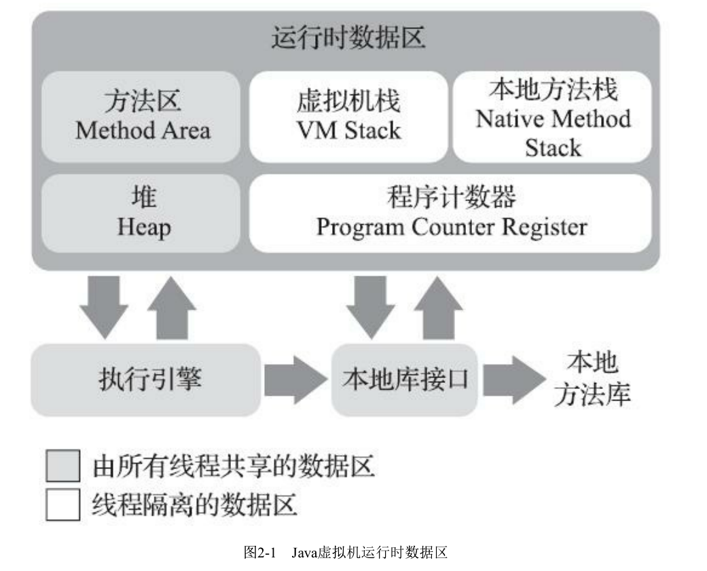

# 第二部分 自动内存管理

## 第二章 Java 内存区域与内存溢出异常

### 2.1 概述

### 2.2 运行时数据区域

运行时数据区：

- 线程共享的数据区：

  方法区

  堆

- 线程隔离的数据区：

  虚拟机栈（VM Stack）

  本地方法栈（Native Method Stack）

  程序计数器（Program Counter Register）

#### 2.2.1 程序计数器

程序计数器是一块较小的内存空间，可以看作是当前线程所执行的字节码的行号指示器。

在 Java 虚拟机的概念模型里，字节码解释器工作时就是通过改变这个计数器的值来选取吓一跳需要制定的字节码指令，它是程序控制流的指示器，分支、循环、跳转、异常处理、县城回复等基础功能都需要以来这个计数器来完成。

**程序计数器线程私有的原因：**

​	Java 多线程虚拟机是通过线程轮流切换、分配处理执行时间的方式来实现的，在任何一个确定的时刻，一个处理器都只会执行一条线程中的指令。为了线程切换后能恢复到正确的执行位置，每条线程都需要有一个独立的程序计数器。

如果线程正在执行的是一个 Java 方法，这个计数器记录的是正在执行的虚拟机字节码指令的地址；如果正在执行的是本地（Native）方法，这个计数器值则应该为空（Undefined）。此内存区域是唯一一个在《Java 虚拟机规范》中没有规定任何 OutOfMemoryError 情况的区域。

#### 2.2.2 Java 虚拟机栈

线程私有，生命周期与线程相同。

Java 虚拟机栈是 Java 方法执行的线程内存模型：每个方法被执行的时候，Java 迅即都会同步创建一个栈帧（Stack Frame）用于存储局部变量表、操作数栈、动态连接、方法出口等信息。每一个方法被调用直至执行完毕的过程，就对应着一个栈帧在虚拟机栈中从入栈到出栈的过程。

在《Java 虚拟机规范》中，对于内存区域规定了两类异常情况：如果线程请求的栈深度大于虚拟机所允许的深度，将会抛出 StackOverFlowError 异常；如果 Java 虚拟机栈容量可以动态扩展，当栈扩展时无法申请到足够的内存会抛出 OutOfMemoryError 异常。

HotSpot虚拟机的栈容量是不可以动态扩展的，以前的Classic虚拟机倒是可以。所以在HotSpot虚拟
机上是不会由于虚拟机栈无法扩展而导致OutOfMemoryError异常——只要线程申请栈空间成功了就不
会有OOM，但是如果申请时就失败，仍然是会出现OOM异常的。

#### 2.2.3 本地方法栈

本地方法栈与虚拟机栈所发挥的作用是非常相似的，其实区别只是虚拟机栈为虚拟机执行 Java 方法（也就是字节码）服务，而本地方法栈则是为虚拟机使用到的本地（Native）方法服务。

#### 2.2.4 Java 堆

Java 堆（Java Heap）是虚拟机所管理的内存中最大的一块。Java 堆是被所有线程共享的一款内存区域，在虚拟机启动时创建。此内存区域的唯一目的就是存放对象实例，Java世界里“几乎所有的对象实例都在这里分配内存。

从分配内存的角度看，所有线程共享的 Java 堆中可以划分出多个线程私有的分配缓冲区（Thread Local Allocation Buffer，TLAB），以提升对象分配时的效率。不过无论从什么角度，无论如何划分，都不会改变 Java 堆中存贮内容的共性，无论哪个区域，存储的都只能是对象的实例，将 Java 堆细分的目的只是为了更好地回收内存，或者更快地分配内存。

Java 堆既可以被实现成固定大小的，也可以是扩展的，不过当前主流的 Java 虚拟机都是按照可以扩展来实现的（通过参数-Xmx和-Xms设定）。如果在 Java 堆中没有内存完成实例分配，并且堆也无法在扩展时，Java 虚拟机将会抛出 OutOfMemoryError 异常。

### 2.2.5 方法区

